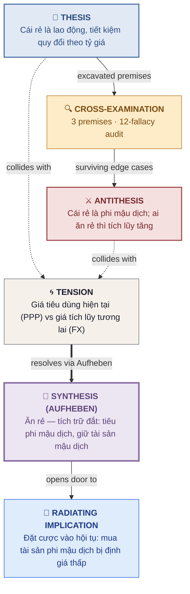
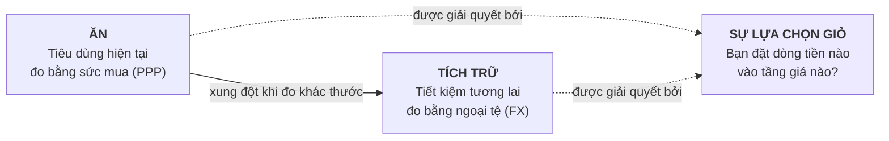

# Mang lương Mỹ về Việt Nam: bài viết đúng ở đâu, sai ở đâu?

> **Version:** 1.2.0 · **Reading time:** ~10 min

Phản biện luận điểm phổ biến trên mạng xã hội: *"Cái rẻ ở Việt Nam không phải hàng hóa, là lao động; 'sống sướng' chỉ là mua được giờ người khác; tiết kiệm quy đổi theo tỷ giá nên về nước không tích lũy được hơn."* — Luận điểm này đúng về xu hướng, sai về tính tuyệt đối; và lợi thế thật của việc mang thu nhập đô-la về nước nằm ở một cấu trúc mà bài viết bỏ lỡ: **ăn rẻ, tích trữ đắt.**

---

## Table of Contents

- [🔧 Assumptions Register — the four Dimensions](#-assumptions-register--the-four-dimensions)
- [🎯 Scope & Assumptions](#-scope--assumptions)
- [👁️ At a Glance — Thesis / Antithesis / Synthesis](#️-at-a-glance--thesis--antithesis--synthesis)
- [🏛️ The Arena — Full Dialectic Pipeline](#️-the-arena--full-dialectic-pipeline)
- [🗺️ The Argument Map (Toulmin)](#️-the-argument-map-toulmin)
- [📘 The Thesis](#-the-thesis)
- [🔍 The Cross-Examination](#-the-cross-examination)
  - [Premise 1 — Nhị phân hai cột giá](#premise-1--nhị-phân-hai-cột-giá)
  - [Premise 2 — "Sướng" = mua giờ người khác](#premise-2--sướng--mua-giờ-người-khác)
  - [Premise 3 — Tiết kiệm quy đổi theo tỷ giá](#premise-3--tiết-kiệm-quy-đổi-theo-tỷ-giá)
- [⚔️ The Antithesis (The Collision)](#️-the-antithesis-the-collision)
- [💎 The Synthesis (The Aufheben)](#-the-synthesis-the-aufheben)
- [🧪 The Proof](#-the-proof)
- [🌊 The Radiating Implication](#-the-radiating-implication)
- [⚠️ Fallacy Log](#️-fallacy-log)
- [📉 Residuals & Boundary Conditions](#-residuals--boundary-conditions)
- [🧠 Knowledge Check](#-knowledge-check)
- [📚 Appendix — The Evidence Locker](#-appendix--the-evidence-locker)

> **📖 Difficulty markers:** 🟢 core-argument · 🟡 supporting · 🔴 optional deep dive.

---

## 🔧 Assumptions Register — the four Dimensions

The Strategic Interview captured (or defaulted) the following four Dimensions before drafting. Change any of them to re-run.

| Dimension | Value | Rationale |
|---|---|---|
| **Adversarial Lens** | EMPIRICAL + PRAGMATIC (chính), ETHICAL (góc phụ) | Luận điểm là kinh tế học cá nhân nên phản biện bằng dữ liệu và thực tiễn; nhưng nó mang hàm đạo đức ("mua giờ người khác") nên cần một góc công bằng. |
| **Rigor of the Elenchus** | GADFLY | Bài viết over-claim ("không có ngoại lệ nào đáng kể", nhị phân hai cột tuyệt đối). Cần săn lùng mâu thuẫn chí mạng. |
| **Dialectical Trajectory** | FORTIFY | Lõi kinh tế của bài viết (giá hai tầng) là đúng và xứng đáng được giữ lại, nhưng phải được sửa điều kiện và thu hẹp phạm vi. |
| **Depth** | SINGLE_COLLISION | Một vòng 10-state duy nhất. |

---

## 🎯 Scope & Assumptions

**Domain.** Kinh tế học cá nhân xuyên biên giới: so sánh sức mua Mỹ–Việt Nam, cấu trúc giá phi mậu dịch/mậu dịch, chiến lược tích lũy của người có thu nhập ngoại tệ.

**In scope:** Giỏ tiêu dùng hộ gia đình, giá dịch vụ/lao động, tiết kiệm và tài sản, hiệu ứng Balassa-Samuelson, cơ chế tỷ giá và sức mua tương đương.

**Out of scope:** Quyết định phi kinh tế (gia đình, cảm xúc, an toàn cá nhân) trừ khi quy ra chi phí; đạo đức học toàn diện về bất bình đẳng — chỉ lấy một góc đủ để làm phép thử.

**Assumptions register:**

- Tỷ giá danh nghĩa VND/USD không biến động đột biến trong kỳ phân tích — *fails if:* mất giá hoặc tăng giá >10% trong 1 năm.
- Người có thu nhập Mỹ giữ tài sản/tiết kiệm bằng USD hoặc tài sản toàn cầu — *fails if:* buộc phải chuyển toàn bộ sang VND.
- Dữ liệu Numbeo 2025–2026 và số liệu báo chí phản ánh đúng mặt bằng giá tương đối — *fails if:* biến động giá lớn chưa được cập nhật.

**Audience posture.** Chuyên gia kinh tế hoài nghi đã đọc bài viết gốc. Sự phản bác sắc nhất họ sẽ nêu: *"Nhưng thực tế hàng nghìn người về nước vẫn để dành được nhiều hơn so với sống ở Mỹ — vậy bài viết sai ở đâu?"*

---

## 👁️ At a Glance — Thesis / Antithesis / Synthesis

| Position | Claim |
|---|---|
| 📘 **Thesis** | Mang thu nhập đô-la về VN, cái rẻ là lao động không phải hàng hóa; "sống sướng" là mua giờ người khác giá chiết khấu; tiết kiệm quy đổi theo tỷ giá nên không tích lũy được bằng. |
| ⚔️ **Antithesis** | Trục thật không phải "lao động/hàng hóa" mà là "mậu dịch/phi mậu dịch"; "sướng" không quy được về giờ thuê được và chính là địa tô bất bình đẳng; tiết kiệm là phần dôi của tiêu dùng — ai ăn rẻ thì để dành bằng đô **nhiều hơn**, không ít đi. |
| 💎 **Synthesis** | Lợi thế đô-la tại VN là cấu trúc **ăn rẻ — tích trữ đắt**: tiêu dùng ở tầng phi mậu dịch giá thấp, giữ tài sản mậu dịch giá toàn cầu; địa tô chênh lệch sẽ bị hội tụ phát triển xóa bỏ — và điều đó là tốt. |

> [!TIP]
> Đọc bảng này trước. Nếu bạn đã bất đồng với Synthesis, nhảy thẳng tới [Fallacy Log](#️-fallacy-log) và [Residuals](#-residuals--boundary-conditions) — nơi sự trung thực của lập luận sống.

---

## 🏛️ The Arena — Full Dialectic Pipeline

Trước khi đi vào cấu trúc bên trong của synthesis, đây là *hình dạng* của toàn bộ lập luận: Thesis và Antithesis va chạm, hội tụ vào một Tension được đặt tên, rồi thăng hoa qua Aufheben thành Synthesis, từ đó lan tỏa một implication mới.



> [!TIP]
> Đây là **chế độ pipeline** — toàn bộ lập luận trong một nhìn. Phần tiếp theo, [The Argument Map (Toulmin)](#️-the-argument-map-toulmin), cho thấy **cấu trúc bên trong** của Synthesis. Đọc cả hai để thấy cả hình dạng của cú va chạm lẫn kiến trúc chịu lực của lời giải.

---

## 🗺️ The Argument Map (Toulmin)

Synthesis trong dạng cấu trúc. Mọi lập luận không phân rã được thành sáu thành phần này đều đang giấu một warrant không được nói ra.

```mermaid
flowchart TD
    G[GROUNDS<br/>Bằng chứng, dữ liệu, quan sát<br/><br/>Numbeo: thuê nhà -80%, gạo -80%,<br/>nhà hàng -4.6x; nhưng gas 0%, bò -37%<br/>IMF xác nhận hiệu ứng B-S ở nước đang phát triển]
    W[WARRANT<br/>Cầu logic<br/><br/>Giá phi mậu dịch gắn lương nội địa,<br/>giá mậu dịch gắn thị trường toàn cầu;<br/>người có ngoại tệ hưởng được cả hai]
    B[BACKING<br/>Lý thuyết sâu<br/><br/>Balassa–Samuelson (1964): nước lương thấp<br/>có giá phi mậu dịch rẻ hơn]
    C[CLAIM<br/>Vị trí tổng hợp<br/><br/>Ăn rẻ, tích trữ đắt — lợi thế đô-la nằm ở<br/>việc tách tiêu dùng phi mậu dịch khỏi tài sản mậu dịch]
    Q[QUALIFIER<br/>Phạm vi giá trị<br/><br/>Đúng khi: giữ tài sản ngoại tệ/mậu dịch,<br/>tiêu tầng phi mậu dịch, chấp nhận địa tô co hẹp]
    R[REBUTTAL<br/>Phản ví dụ<br/><br/>Học phí quốc tế/Singapore là cột đắt —<br/>nhưng đó là lựa chọn nhập khẩu giỏ Mỹ,<br/>không phải định luật]
    G --> W --> C
    B --> W
    Q -->|giới hạn| C
    R -->|không lật đổ| C

    style C fill:#EDE9FE,stroke:#6B46C1,stroke-width:2px
    style R fill:#FEF6E4,stroke:#B7791F
    style G fill:#E6FFFA,stroke:#319795
```

**In prose form:**

| Component | Content |
|---|---|
| **Claim** | Lợi thế thật của việc mang thu nhập đô-la về VN không phải "mua giờ người khác" mà là cấu trúc **ăn rẻ — tích trữ đắt**: tiêu dùng ở tầng phi mậu dịch giá thấp, giữ tài sản ở tầng mậu dịch giá toàn cầu, để tích lũy tính theo đô-la **tăng lên** trong khi địa tô chênh lệch đang bị hội tụ phát triển xóa bỏ. |
| **Grounds** | Numbeo (2025–26): thuê nhà VN rẻ hơn Mỹ ~80%, gạo/bánh mì rẻ ~75–80%, giá nhà hàng rẻ ~4,6 lần; nhưng xăng bằng giá, thịt bò chỉ rẻ ~37%, iPhone đắt hơn. Lương tối thiểu vùng I ~4,96 triệu (~$190–200/tháng). IMF xác nhận hiệu ứng Balassa-Samuelson ở nước đang phát triển. Chỉ số Phở Bát Đàn: 2004 → 2022 tăng 6 lần. |
| **Warrant** | Giá phi mậu dịch (nhà đất, dịch vụ tại chỗ, lao động phổ thông) gắn với mức lương nội địa; giá mậu dịch (xăng, iPhone, xe hơi) gắn với thị trường toàn cầu. Người có thu nhập ngoại tệ có thể tách dòng tiêu dùng (đặt vào tầng rẻ) khỏi dòng tài sản (đặt vào tầng đắt). |
| **Backing** | Hiệu ứng Balassa-Samuelson: nền kinh tế có năng suất mậu dịch cao hơn sẽ có giá phi mậu dịch cao hơn; nước lương thấp thì ngược lại. Đây là cơ chế đằng sau câu "bát phở 60k nhưng thịt bò không rẻ ba lần". |
| **Qualifier** | Synthesis chỉ đúng khi: (a) người giữ thu nhập/tài sản bằng ngoại tệ hoặc tài sản mậu dịch; (b) sẵn sàng tiêu dùng ở tầng phi mậu dịch của VN (không nhập khẩu toàn bộ giỏ Mỹ); (c) chấp nhận địa tô co hẹp theo hội tụ. Gãy khi bị ép giữ VND trong giai đoạn mất giá, hoặc tiêu dùng toàn bộ ở tầng mậu dịch. |
| **Rebuttal** | Phản ví dụ mạnh nhất: học phí quốc tế, khám Singapore, tài sản ngoài biên giới đều ở cột đắt. Trả lời: đó là **lựa chọn nhập khẩu giỏ tiêu dùng Mỹ** — ai chọn giữ nguyên tiêu chuẩn quốc tế sẽ đúng như bài viết nói; ai đổi giỏ thì hưởng lợi. Và rủi ro tỷ giá chỉ thật sự đánh người giữ VND, không đánh người giữ USD. |

---

## 📘 The Thesis

🟢 **Core.**

> 📘 **The Thesis:** *"Mang thu nhập đô-la về Việt Nam, cái 'rẻ' nằm ở lao động chứ không phải hàng hóa; 'sống sướng' là mua được giờ người khác với giá chiết khấu — một hàm của khoảng cách thu nhập, không phải thuộc tính đất nước — và tiết kiệm quy đổi theo tỷ giá, nên về nước không hẳn tích lũy được hơn."*
>
> **The Dialectical Contract:** *We accept this proposition as our starting point. But does it hold under scrutiny?*

### Load-Bearing Premises (Excavated)

Để Thesis đứng vững, cả ba điều sau phải đúng. Nếu một điều gãy, lập luận sụp đổ.

1. **P1 — Nhị phân hai cột giá:** Có một đường phân chia sạch: *cột rẻ = toàn bộ lao động (ăn hàng, giúp việc, tài xế, thợ sửa, massage, caddie, xây nhà, ship đồ khuya)*; *cột đắt = toàn bộ hàng hóa (ô tô, iPhone, rượu ngoại, vé máy bay, khám Singapore, học phí quốc tế)*. "Không có ngoại lệ nào đáng kể."
2. **P2 — "Sướng" = mua giờ người khác:** "Toàn bộ nội dung của cái gọi là 'về VN sống sướng hơn' là được miễn những giờ mà bên kia không ai miễn cho anh." Sự dễ chịu "đúng bằng độ chênh giữa giờ của tôi và giờ của người phục vụ tôi", và nó là hàm của khoảng cách, không phải thuộc tính đất nước.
3. **P3 — Tiết kiệm quy đổi theo tỷ giá:** "Tôi tiêu như người 17 nghìn đô một tháng, và để dành như người 5 nghìn 700." Vì mục tiêu của tiền để dành (học phí con, viện phí tử tế, tài sản ngoài biên giới) đều nằm ở cột đắt.

> [!IMPORTANT]
> Mỗi premise dưới đây có một vòng Cross-Examination riêng: **Probe** → **Edge Case** → **Hear the Defense**. Đọc Probe và ngồi với sự nghi ngờ *trước khi* bấm mở Defense. Đó là điểm sư phạm — sự bất hòa nhận thức là nguyên liệu thô của synthesis.

---

## 🔍 The Cross-Examination

🟢 **Core.**

Độ khắc nghiệt của phần này là **GADFLY**. Lăng kính phản biện là **EMPIRICAL + PRAGMATIC**, với một góc **ETHICAL** ở Premise 2.

### Premise 1 — Nhị phân hai cột giá

***Q: Nhị phân "lao động rẻ / hàng hóa đắt" có đứng vững trước dữ liệu thực tế không?***

Premise 1 giả định rằng cột "rẻ" là toàn bộ lao động và cột "đắt" là toàn bộ hàng hóa, không có ngoại lệ đáng kể. Nhưng điều này chỉ đúng nếu trục phân chia thật sự là "lao động vs hàng hóa" — và dữ liệu cho thấy trục thật khác.

<details>
<summary>🛡️ <strong>Hear the Defense — reveal the edge case and rebuttal</strong></summary>

**Edge Case (EMPIRICAL lens):** Numbeo (cập nhật 2026) cho thấy thứ rẻ nhất ở VN so với Mỹ **không phải là lao động mà là thuê nhà** (rẻ ~80%, riêng thuê 1 phòng trung tâm Hà Nội so với New York rẻ tới ~10 lần) — nhà đất là hàng hóa/tài sản, không phải "lao động". Ngược lại, gạo rẻ ~80%, bánh mì rẻ ~74% — hàng hóa lại rẻ hơn "ba lần" mà bài viết phủ nhận. Trong khi đó, xăng bằng giá (chỉ chênh ~2%), thịt bò chỉ rẻ ~37%, iPhone và xe hơi đắt hơn. Và **lao động có kỹ năng không rẻ**: bác sĩ giỏi tư nhân, luật sư, kỹ sư phần mềm senior ở VN có giá giờ không hề rẻ 3 lần Mỹ. Vậy trục đúng không phải "lao động/hàng hóa" mà là **mậu dịch (tradable) / phi mậu dịch (non-tradable)** — đúng như hiệu ứng Balassa-Samuelson dự báo.[^1] Người đứng bếp rẻ không phải vì anh ta là "lao động" mà vì bát phở là dịch vụ phi mậu dịch, không thể nhập khẩu.

**Steel-Man Check:**
- **SM-1 (Recognition):** Người hâm mộ bài viết nhận ra edge case này là đúng trọng tâm — họ không lăn mắt.
- **SM-2 (Target Fidelity):** Probe nhắm vào đúng khẳng định "không có ngoại lệ nào đáng kể", không phải một phiên bản yếu hơn.
- **SM-3 (Evidence Grade):** Dùng dữ liệu Numbeo và kinh tế học chuẩn (B-S), mạnh nhất có thể cho phía phản biện.

**The Defense:** Người bảo vệ bài viết sẽ trả lời: "Tôi đang mô tả *xu hướng trung bình* cho giỏ tiêu dùng của một gia đình thu nhập cao — phần lớn thứ họ chi tiền vào, khi rẻ thì là dịch vụ lao động, khi đắt thì là hàng nhập khẩu. Ví dụ của tôi là minh họa, không phải định luật." Defense này xử lý được bề mặt edge case nhưng không vô hiệu được nó hoàn toàn, vì **thuê nhà — khoản chi lớn nhất — là hàng hóa và lại rẻ nhất**, phá vỡ chính cột "đắt = hàng hóa".

**Verdict:** Defense holds *partially*. Trục "mậu dịch/phi mậu dịch" phải thay trục "lao động/hàng hóa" trong State 5.

</details>

---

### Premise 2 — "Sướng" = mua giờ người khác

***Q: "Sống sướng" có thể quy về việc thuê giờ người khác không — và ai đang trả tiền cho cái giá chiết khấu ấy?***

Premise 2 khẳng định toàn bộ nội dung của "sống sướng hơn" là mua lại giờ của mình bằng giờ người khác với giá rẻ. Điều này vừa giảm thiểu tính đa chiều của hạnh phúc, vừa bỏ qua cấu trúc đạo đức của cái "rẻ" đó.

<details>
<summary>🛡️ <strong>Hear the Defense — reveal the edge case and rebuttal</strong></summary>

**Edge Case (ETHICAL + PHILOSOPHICAL lens):** Lương tối thiểu vùng I của VN là ~4,96 triệu đồng/tháng (~$190–200); lương giúp việc ở lại phổ biến 8–12 triệu (~$320–480).[^2] Cái "sướng" của người lương đô-la là **địa tô bất bình đẳng**: cùng một giờ lao động, người phục vụ ở VN được trả ít hơn rất nhiều so với người phục vụ ở Mỹ — sự dễ chịu của người này là sự thiếu thốn tương đối của người kia. Bài viết thừa nhận điều này trong một câu ("Đó không phải mất mát. Đó là mục tiêu.") rồi gói nó lại như một lời an ủi. Thêm nữa, câu "mua lại được chính thời gian của anh" là **đánh tráo khái niệm**: thuê giờ lao động không làm thời gian của bạn quay lại — nó chỉ chuyển công việc đi. Và nhiều thứ quan trọng của đời người **không thuê được**: sức khỏe khi ốm nặng, không khí sạch, an toàn công cộng, hệ thống y tế khẩn cấp hoạt động, cộng đồng, pháp quyền. Bác sĩ Mỹ phải "tự lắp tủ IKEA", nhưng bác sĩ đó có hệ thống chống đỡ mà tiền ở VN khó mua trọn vẹn — "sướng" có một tầng **phi mậu dịch của phúc lợi** mà bài viết bỏ qua.

**Steel-Man Check:**
- **SM-1 (Recognition):** Tác giả bài viết (một bác sĩ, tự nhận mình "biết rõ mình đang mua nó từ ai") sẽ nhận ra mối bận tâm này là của chính họ.
- **SM-2 (Target Fidelity):** Probe nhắm đúng vào khẳng định "toàn bộ nội dung của 'sống sướng hơn' là mua giờ người khác".
- **SM-3 (Evidence Grade):** Dùng mức lương tối thiểu và giá giúp việc thực tế — dữ liệu công khai mạnh nhất cho phía đạo đức.

**The Defense:** Người bảo vệ bài viết sẽ trả lời: "Tôi không định nghĩa toàn bộ 'sướng'; tôi chỉ bóc tách thành phần *kinh tế* của nó để bố mẹ tôi hiểu vì sao 'sống rẻ hơn' là một câu nói lệch. Tôi đã nói rõ mặt đạo đức: 'Ngày bát phở lên 20 đô chính là ngày người bê phở sống được gần bằng người ăn phở. Đó là mục tiêu.'" Defense này xử lý bề mặt edge case nhưng không vô hiệu được nó, vì câu "đó là mục tiêu" không được gắn vào lập luận — nó là một lời dè dặt bên lề, trong khi toàn bộ phần còn lại của bài viết tận hưởng địa tô đó mà không định giá nó.

**Verdict:** Defense holds *partially*. "Sướng" có một thành phần đạo đức và một tầng phúc lợi phi mậu dịch mà State 5 phải hấp thụ.

</details>

---

### Premise 3 — Tiết kiệm quy đổi theo tỷ giá

***Q: Tiết kiệm là phần dôi của tiêu dùng — nếu bạn ăn ở cột rẻ, thì để dành bằng đô lại tăng lên, làm sao nói 'quy đổi theo tỷ giá'?***

Premise 3 cho rằng tiêu dùng quy đổi theo sức mua còn tiết kiệm quy đổi theo tỷ giá, nên về nước không tích lũy được hơn. Đây là mâu thuẫn nội tại lớn nhất của bài viết, vì tiết kiệm không phải một khoản độc lập — nó là **thu nhập trừ tiêu dùng**.

<details>
<summary>🛡️ <strong>Hear the Defense — reveal the edge case and rebuttal</strong></summary>

**Edge Case (PRAGMATIC + EMPIRICAL lens):** Lấy đúng con số của bài viết. Thu nhập 400tr/tháng, sống ở VN, tiêu dùng ở tầng phi mậu dịch (nhà, ăn địa phương, giúp việc) hết 80tr, thì phần để dành là **320tr (~$12.500)** — nhiều hơn hẳn nếu sống ở Mỹ với chi phí tương đương. Câu "để dành như người 5.700 đô" chỉ đúng khi bạn **nhập khẩu giỏ tiêu dùng Mỹ**: tiêu 300tr+ vào cột đắt (trường quốc tế, hàng nhập, khám nước ngoài) rồi mới để dành phần còn lại. Đó là một lựa chọn lối sống, không phải định luật. Ngược lại, người **trả lương bằng USD và giữ tiền USD thì không hề chịu rủi ro tỷ giá** — chính người làm công ăn lương VND muốn để dành USD mới là người bị tỷ giá ăn mòn. Bài viết đã nhầm tham chiếu: nó áp lô-gíc của người hưởng lương VND lên người hưởng lương USD.[^3]

**Steel-Man Check:**
- **SM-1 (Recognition):** Người bảo vệ bài viết nhận ra đây là phản bác đúng chỗ — nó khai thác chính công thức "tiêu như 17k, để dành như 5,7k".
- **SM-2 (Target Fidelity):** Probe nhắm thẳng vào khẳng định "tiết kiệm quy đổi theo tỷ giá" — premise thứ ba, không phải premise phụ.
- **SM-3 (Evidence Grade):** Dùng chính số liệu và logic nội tại của bài viết, kèm cơ chế tỷ giá chuẩn.

**The Defense:** Người bảo vệ bài viết sẽ trả lời: "Tôi đang nói về trường hợp một gia đình **giữ tiêu chuẩn quốc tế** khi về nước — con học trường quốc tế, khám bệnh ở Singapore, đầu tư tài sản ngoài biên giới. Với giả định đó, phần tiết kiệm của họ thật sự chạm cột đắt và quy đổi theo tỷ giá." Defense này đúng trong giả định của nó nhưng không cứu được premise ở dạng tổng quát, vì giả định "giữ nguyên giỏ Mỹ" tự nó đã phủ nhận mục đích "về nước để dành" — và chính bài viết công nhận giỏ sẽ đổi ("ngày phở lên 20 đô").

**Verdict:** Defense holds *partially*. Premise 3 chỉ đúng cho giỏ tiêu dùng nhập khẩu; với giỏ nội địa, nó đảo ngược.

</details>

---

> [!WARNING]
> **🛡️ FALLACY DIAGNOSTIC — inline audit (State 3)**
>
> Trong Cross-Examination trên, bộ kiểm 12-fallacy đã phát hiện và *viết lại* các điều sau. Log đầy đủ với before/after nằm ở [Fallacy Log](#️-fallacy-log) phía dưới; alert gọn này để bạn thấy kết quả kiểm đúng lúc quan trọng nhất — sau khi nhiên liệu va chạm được nạp, trước khi nó phát nổ.
>
> - `False Dichotomy` — hai cột "lao động/hàng hóa" là nhị phân giả; trục thật là phi mậu dịch/mậu dịch.
> - `Hasty Generalisation` — "không có ngoại lệ nào đáng kể" khái quát hóa từ vài ví dụ; thuê nhà, gạo, lao động kỹ năng đều là ngoại lệ.
> - `Motte-and-Bailey` — nhan đề khẳng định mạnh ("không chắc bằng"), thân bài chỉ chứng minh điều khiêm tốn hơn ("giá hai tầng là có thật").
> - `Equivocation` — "mua lại thời gian của anh" đánh tráo "giờ lao động thuê được" với "thời gian sống của chủ".
>
> **Đã kiểm nhưng không phát hiện:** Straw Man · Slippery Slope · Ad Hominem · Appeal to Authority · Correlation/Causation · No True Scotsman · Base Rate Neglect · Survivorship Bias · Tu Quoque.

---

---

---

## ⚔️ The Antithesis (The Collision)

🟢 **Core.**

Gộp các edge case sống sót từ Cross-Examination thành một phản-mệnh đề chính thức.

**Synthesis of the doubt.** Qua ba vòng cross-examination, mô hình lỗi chí mạng là: *bài viết tuyệt đối hóa một nhị phân, giảm thiểu một đại lượng đa chiều, và nhầm lẫn hướng của một cơ chế kinh tế.* P1 đúng rằng giá hai tầng có thật nhưng sai trục phân chia. P2 đúng rằng lao động dịch vụ rẻ là có thật nhưng sai khi quy "sướng" về giờ thuê được. P3 sai hướng: vì tiết kiệm là phần dôi của tiêu dùng, ai tiêu ở tầng rẻ thì tích lũy **tăng**, không giảm.

> ⚔️ **THE ANTITHESIS:** *"Bài viết tái dựng hiệu ứng Balassa-Samuelson một cách sắc sảo, nhưng biến một xu hướng kinh tế có điều kiện thành một định luật tuyệt đối: cái rẻ thực chất là phi mậu dịch chứ không phải 'lao động'; cái đắt là mậu dịch chứ không phải 'hàng hóa'; 'sống sướng' không quy được về giờ thuê được và chính cái 'sướng' ấy là địa tô bất bình đẳng; và vì tiết kiệm là phần dôi của tiêu dùng, ai tiêu ở cột rẻ sẽ để dành bằng đô nhiều hơn, không ít đi."*
>
> Thesis gãy ở chỗ nó **khóa người đọc vào giỏ tiêu dùng Mỹ trong khi ca ngợi lối sống Việt**. Antithesis thành công vì nó chỉ ra: lợi thế thật của thu nhập ngoại tệ không phải là bị tịch thu qua tỷ giá, mà là **được phép chọn tầng giá cho từng dòng tiền**.

**Named Tension.** Biến số chính xác nơi Thesis và Antithesis va chạm là: **giá tiêu dùng hiện tại (PPP, tầng phi mậu dịch) vs giá tích lũy tương lai (FX, tầng mậu dịch)** — ngắn gọn: *ăn rẻ vs tích trữ đắt*.



> [!WARNING]
> Ngồi lại với cú va chạm này. Cái "Aha!" của phần sau chỉ đáp xuống nếu bạn cảm được sự bất hòa bây giờ. Nếu trực giác thôi bạn nhảy tới lời giải, đó chính là lúc phải dừng.

---

---

---

## 💎 The Synthesis (The Aufheben)

🟢 **Core.**

**Trajectory:** FORTIFY. Không phải Thesis hay Antithesis thắng trắng. Thứ thắng là một **đổi mới cấu trúc**:

> 💎 **THE SYNTHESIS (Aufheben):** *"Lợi thế của việc mang thu nhập đô-la về Việt Nam không nằm ở chỗ 'sống sướng hơn' (mua giờ người khác) mà nằm ở cấu trúc **ăn rẻ — tích trữ đắt**: tiêu dùng ở tầng phi mậu dịch giá thấp, giữ tài sản ở tầng mậu dịch giá toàn cầu — nhờ đó tích lũy tính theo đô-la tăng lên, trong khi địa tô chênh lệch đang bị hội tụ phát triển xóa bỏ, và việc nó biến mất chính là điều đáng mong."*

### The Elevation

**Synthesis giữ lại gì từ Thesis:**

Đúng là giá hai tầng có thật — người lương cao ở nước năng suất cao vẫn phải tự làm nhiều việc vì giờ của họ đắt; người về VN có thể mua dịch vụ của người khác với giá rẻ; và bát phở rẻ vì giá giờ của người đứng bếp thấp. Bài viết đã nhìn thấy một hiện tượng kinh tế chân thực (Balassa-Samuelson được tái khám phá bằng trực giác). Điều đó không bị vứt bỏ.

**Synthesis hấp thụ gì từ Antithesis:**

Trục phân chia đúng là **mậu dịch/phi mậu dịch**, không phải lao động/hàng hóa — thuê nhà (hàng hóa) là thứ rẻ nhất, lao động có kỹ năng (lao động) lại không rẻ. "Sướng" có tầng phúc lợi phi mậu dịch không mua được bằng tiền, và cái "rẻ" của dịch vụ là địa tô bất bình đẳng có giá đạo đức. Và vì tiết kiệm là phần dôi của tiêu dùng, người tiêu ở tầng rẻ sẽ **tích lũy nhiều hơn** bằng đô, không ít đi — bài viết đã nhầm hướng của cơ chế.

**The Aha!** Tension được đặt tên — *ăn rẻ vs tích trữ đắt* — được giải quyết không phải bằng cách chọn một bên, mà bằng cách nhận ra rằng **bạn không phải chọn giữa "VN rẻ" và "VN đắt"; bạn chọn tầng giá cho từng dòng tiền.** Dòng tiêu dùng đặt vào phi mậu dịch (rẻ), dòng tài sản đặt vào mậu dịch (đắt, toàn cầu). Thesis đúng khi bạn nhập khẩu giỏ Mỹ; Antithesis đúng khi bạn đổi giỏ; Synthesis đặt tên cho điều kiện C: **đổi giỏ tiêu dùng, giữ nguyên chuẩn tài sản.**

### Comparative outcomes under the Synthesis

Minh họa tương đối cho thu nhập 400tr/tháng (số liệu minh họa theo cấu trúc):

```
Nhập khẩu giỏ Mỹ khi về VN   ██████████░░░░░░░░░░░░  tích lũy thấp (đúng bài viết)
Sống Mỹ toàn phần           █████████████░░░░░░░░░  tích lũy trung bình
Tiêu phi mậu dịch, giữ VND  ███████████████░░░░░░░  tích lũy khá, rủi ro tỷ giá
Ăn rẻ — tích trữ đắt  ▶     ████████████████████░░  tích lũy cao nhất, địa tô co hẹp
```

> [!IMPORTANT]
> Nếu Synthesis đọc ra như "một chút của cả hai" hoặc "chân lý nằm ở giữa", thì nó chưa phải synthesis — nó là Argument to Moderation. "Ăn rẻ, tích trữ đắt" không phải là trung bình của "VN rẻ" và "VN đắt"; nó là **đặt hai dòng tiền khác nhau vào hai tầng giá khác nhau** — một thay đổi cấu trúc, không phải một tỷ lệ 50/50.

---

## 🧪 The Proof

🟡 **Supporting.**

**Primary case.** Số liệu Numbeo 2025–2026 cho thấy cấu trúc giá hai tầng hoạt động đúng như kinh tế học dự báo: thuê nhà (phi mậu dịch) rẻ ~80%, gạo và bánh mì (hàng hóa nhưng sản xuất nội địa) rẻ ~75–80%, giá nhà hàng rẻ ~4,6 lần; nhưng xăng (mậu dịch thuần) bằng giá, thịt bò (bán mậu dịch) chỉ rẻ ~37%, iPhone và xe hơi (mậu dịch) đắt hơn.[^1] Cấu trúc này khớp chính xác với dự báo Balassa-Samuelson: chỉ hàng phi mậu dịch mới rẻ ở nước lương thấp. Đây là ground cho Qualifier — và đồng thời cho thấy cột "đắt = hàng hóa" của bài viết chứa cả hàng hóa rẻ nhất lẫn đắt nhất.

**Mapping to Toulmin.** Dữ liệu là Grounds: chúng chỉ ra trục đúng là mậu dịch/phi mậu dịch (chứa đựng trực giác "lao động rẻ" của bài viết), làm nền cho Warrant "tách dòng tiêu dùng khỏi dòng tài sản".

**Contrasting case.** Chỉ số **Phở Bát Đàn**: 2004 giá 10.000đ → 2010: 30.000đ → 2018: 50.000đ → 2022: 60.000đ — gấp 6 lần trong 18 năm (~10%/năm).[^4] Đến 2025, phở phổ biến ở Hà Nội đã là 35–45.000đ, quán nổi tiếng lên tới 90.000đ.[^5] Đây chính là **hội tụ Balassa-Samuelson đang chạy ngay trước mắt**: tầng phi mậu dịch đang tự đắt lên theo phát triển. Case này test Qualifier: cái "rẻ" mà bài viết mô tả không phải thuộc tính vĩnh viễn — nó là một cửa sổ đang đóng lại, và bài viết tự dự báo điều đó ("ngày phở lên 20 đô là mục tiêu").

> **💡 Sidenote — illustration vs discovery:**
> Những case này không *thiết lập* synthesis. Chúng được chọn vì synthesis đã được rèn trong các state trên. Minh họa xác nhận một lập luận đã rèn; nó không bao giờ được *là* lập luận.

---

## 🌊 The Radiating Implication

🟢 **Core.**

### The Applied Test

Một kịch bản mới — chưa xuất hiện ở trên — nơi Synthesis phải được áp dụng.

Một kỹ sư phần mềm làm remote, lương 10.000 USD/tháng, sống ở Hà Nội cùng gia đình Việt. Áp dụng Synthesis: cô nên **tiêu ở tầng phi mậu dịch** (thuê nhà, ăn địa phương, thuê giúp việc, học phí trường công tốt hoặc bán quốc tế) và **giữ tài sản ở tầng mậu dịch** (tiền gửi/chứng khoán Mỹ, index funds toàn cầu), tránh nhập khẩu giỏ Mỹ (trường quốc tế full-price + hàng nhập + khám nước ngoài thường xuyên) trừ khi đó là lựa chọn có chủ đích. Nếu cô giữ tiền bằng USD, tỷ giá không ăn mòn cô. Và — phần mà bài viết bỏ lỡ — cô nên cân nhắc **mua tài sản phi mậu dịch của VN đang bị định giá thấp** (đất/ nhà ở khu đang hội tụ), vì khi Balassa-Samuelson chạy tiếp, tầng phi mậu dịch sẽ tự tăng giá theo phát triển — địa tô không biến mất vô ích, nó chuyển thành lợi tức tài sản cho người đã đứng trước.

Walking through the application: thay vì hỏi "VN rẻ hay đắt", Synthesis hỏi **"dòng tiền này của tôi nằm ở tầng giá nào?"** — một câu hỏi vận hành được cho từng quyết định chi tiêu, tích lũy, đầu tư.

### The Radiating Implication

> 🌊 **If this Synthesis is true, then it must also be true that:** *"Nếu cái rẻ của VN là tầng phi mậu dịch và địa tô đó đang bị hội tụ xóa bỏ, thì chiến lược tối ưu của người có thu nhập ngoại tệ tại VN là **đặt cược vào sự hội tụ**: mua tài sản phi mậu dịch đang bị định giá thấp, trong khi giữ đô-la để tự bảo hiểm rủi ro tỷ giá."*

The adjacent domain fundamentally challenged by this implication is **kinh tế học hội tụ và đầu tư tài sản tại thị trường cận biên (frontier markets)**. Vòng dialectic kế tiếp sẽ lấy implication này làm Thesis và chất vấn nó trong miền đó: đặt cược hội tụ có phải là một chiến lược đầu tư đứng đắn, hay chỉ là một dạng "lương hóa" rủi ro pháp lý của thị trường cận biên?

> [!TIP]
> Radiating Implication này là hạt giống cho vòng dialectic kế tiếp — xem ghi chú "Continue or Iterate?" ở cuối tài liệu.

---

## ⚠️ Fallacy Log

🟡 **Supporting.**

Mỗi mục đặt tên một fallacy phát hiện trong State 3 (Fallacy Diagnostic) và rewrite mà nó ép buộc. Một log đóng là chuyện thường; một log trống thì không.

<details>
<summary><strong>⚠️ Fallacy Log — 4 detections from the 12-fallacy audit</strong></summary>

### Detection 1: False Dichotomy
- **Location:** Premise 1 — hai cột "cột rẻ = lao động, cột đắt = hàng hóa".
- **Why it compromised the argument:** Ép một trục liên tục (mức độ phi mậu dịch của hàng hóa/dịch vụ) vào một cặp nhị phân, khiến thuê nhà (hàng hóa nhưng rẻ nhất) và lao động kỹ năng (lao động nhưng đắt) thành "ngoại lệ" thay vì bằng chứng về trục sai.
- **Rewrite:** "Cột rẻ là hàng hóa/dịch vụ phi mậu dịch; cột đắt là hàng hóa/dịch vụ mậu dịch hoặc có năng suất toàn cầu."

### Detection 2: Hasty Generalisation
- **Location:** "Không có ngoại lệ nào đáng kể" — khái quát từ một danh sách ví dụ chọn lọc.
- **Why it compromised the argument:** Một vài ví dụ đúng không cho phép kết luận toàn miền; dữ liệu Numbeo có ngoại lệ lớn (thuê nhà, gạo, bánh mì, lao động kỹ năng).
- **Rewrite:** "Xu hướng chung là có thật, nhưng có ngoại lệ đáng kể; trục giải thích các ngoại lệ là mậu dịch/phi mậu dịch."

### Detection 3: Motte-and-Bailey
- **Location:** Nhan đề và kết luận ("không chắc bằng ở VN kiếm tiền tiêu tại VN") so với thân bài ("cái rẻ là lao động").
- **Why it compromised the argument:** Bảo vệ một mệnh đề khiêm tốn (giá hai tầng có thật — đúng) để đẩy một mệnh đề tham vọng (mang lương Mỹ về không tích lũy được — chưa được chứng minh).
- **Rewrite:** Nhan đề nên khớp với bằng chứng: "Cái rẻ ở VN là lao động phi mậu dịch — và nó đang đắt dần lên." Mệnh đề mạnh chỉ đúng cho giỏ tiêu dùng nhập khẩu.

### Detection 4: Equivocation
- **Location:** "Anh mua lại được chính thời gian của anh."
- **Why it compromised the argument:** Trượt giữa hai nghĩa của "thời gian": (a) giờ lao động của người khác mà bạn thuê — có thể mua; (b) thời gian sống của bạn — không thể mua lại được, vì thời gian không hồi phục.
- **Rewrite:** "Anh thuê được công việc của người khác, do đó giải phóng giờ của mình — nhưng thời gian đã qua không trở lại; và nhiều thứ quan trọng của cuộc sống không thuê được."

</details>

**Full 12-fallacy audit summary** (✅ = đã kiểm; ⚠️ = phát hiện và viết lại):

| # | Fallacy | Status |
|---|---|---|
| 1 | Straw Man | ✅ Không phát hiện |
| 2 | False Dilemma | ⚠️ Detection 1 |
| 3 | Slippery Slope | ✅ Không phát hiện |
| 4 | Ad Hominem | ✅ Không phát hiện |
| 5 | Appeal to Authority | ✅ Không phát hiện |
| 6 | Hasty Generalisation | ⚠️ Detection 2 |
| 7 | Correlation / Causation | ✅ Không phát hiện |
| 8 | No True Scotsman | ✅ Không phát hiện |
| 9 | Motte-and-Bailey | ⚠️ Detection 3 |
| 10 | Base Rate Neglect | ✅ Không phát hiện |
| 11 | Survivorship Bias | ✅ Không phát hiện |
| 12 | Tu Quoque | ✅ Không phát hiện |
| — | Equivocation (ngoài 12) | ⚠️ Detection 4 |

---

## 📉 Residuals & Boundary Conditions

🟢 **Core.**

Sự tự đánh giá trung thực của lập luận. Một dialectic không có residuals là tuyên truyền đội lốt dialectic.

### What this argument does *not* cover

- **Thuế Mỹ và an sinh xã hội:** FEIE/Foreign Tax Credit, Medicare/SSA, chi phí hồi hương chưa được định giá.
- **Rủi ro pháp lý và địa chính trị:** sở hữu đất đai của người Việt định cư nước ngoài, kiểm soát vốn, rủi ro chính sách.
- **Tầng phi kinh tế của "sướng":** gia đình, cộng đồng, an toàn, y tế khẩn cấp, môi trường — được nhắc như một giới hạn chứ không định giá.
- **Phân phối không đồng đều:** mức "hưởng lợi" của cấu trúc ăn-rẻ-tích-trữ-đắt khác nhau lớn theo thành phố (Hà Nội/HCM/Đà Nẵng) và theo giai đoạn đời (trẻ độc thân vs gia đình có con).

### Falsifiers — observations that would force retraction

- VND **tăng giá** mạnh so với USD trong khi giá tài sản phi mậu dịch của VN trì trệ → địa tô không chuyển thành lợi tức tài sản, cấu trúc "tích trữ đắt" mất một chân.
- Lương tối thiểu VN tăng ≥15%/năm trong 5 năm liên tiếp → hội tụ nhanh hơn dự kiến, cửa sổ "ăn rẻ" đóng trước khi ai kịp tích lũy.
- Một khảo sát cho thấy người về nước chi >50% thu nhập vào tầng mậu dịch → giả định "đổi giỏ" không xảy ra trong thực tế, và bài viết gốc thắng.

### Confidence levers

- ↑ Dữ liệu Numbeo xác nhận trục phi mậu dịch/mậu dịch (rent -80% vs gas 0%) — tăng tin cậy cho Warrant.
- ↑ Các nghiên cứu IMF xác nhận hiệu ứng B-S hiện diện ở nước đang phát triển — tăng tin cậy cho Backing.
- ↓ Nếu phát hiện giá phi mậu dịch VN đã ngang bằng mức trung bình ASEAN → địa tô gần như đã đóng, Synthesis giảm giá trị vận hành.
- ↓ Nếu rủi ro pháp lý sở hữu tài sản VN tăng (kiểm soát vốn, đất đai) → "tích trữ đắt" chỉ còn ở tầng tài sản nước ngoài, hẹp hơn tuyên bố.

> [!WARNING]
> Nếu bằng chứng mới trúng các mục falsifier, lập luận này phải được rút lại, không phải bảo vệ.

---

## 🧠 Knowledge Check

Ba câu hỏi. Chúng kiểm tra xem bạn có thể bảo vệ *cấu trúc* của lập luận, không phải ghi nhớ ví dụ của nó.

**Question 1: Trục phân chia đúng giữa "cái rẻ" và "cái đắt" ở VN so với Mỹ là gì?**

- [ ] a. Lao động so với hàng hóa.
- [ ] b. Hàng hóa nhập khẩu so với hàng hóa nội địa.
- [ ] c. Phi mậu dịch (gắn lương nội địa) so với mậu dịch (gắn thị trường toàn cầu).
- [ ] d. Tiêu dùng so với tiết kiệm.

**Question 2: Tại sao Premise 3 ("tiết kiệm quy đổi theo tỷ giá") bị đảo ngược khi đổi giỏ tiêu dùng?**

- [ ] a. Vì tỷ giá luôn đứng yên.
- [ ] b. Vì tiết kiệm là thu nhập trừ tiêu dùng — tiêu ở tầng rẻ thì phần để dành bằng đô tăng lên.
- [ ] c. Vì người Việt không giữ USD.
- [ ] d. Vì lạm phát ở Mỹ cao hơn.

**Question 3: "Sống sướng" không thể quy hoàn toàn về việc thuê giờ người khác vì lý do gì?**

- [ ] a. Vì giúp việc ở VN không đáng tin.
- [ ] b. Vì lao động dịch vụ quá đắt ở VN.
- [ ] c. Vì có một tầng phúc lợi phi mậu dịch (y tế khẩn cấp, an toàn, pháp quyền, cộng đồng) không mua được bằng tiền, và "mua giờ người khác" không làm thời gian của bạn quay lại.
- [ ] d. Vì bác sĩ Mỹ không thích tự lắp IKEA.

**Question 4: Có người đề xuất một phương án trung dung cho Synthesis — ví dụ "cứ sống 50% theo kiểu Việt, 50% theo kiểu Mỹ". Vì sao đây là *Argument to Moderation* (False Compromise) chứ không phải synthesis thật?**

- [ ] a. Vì tỷ lệ đúng phải là 70/30 thay vì 50/50.
- [ ] b. Vì nó chia đôi giữa hai vị trí trên cùng một trục (mức độ "nhập khẩu giỏ Mỹ") mà không đụng tới biến số nền (đặt dòng tiêu dùng vào phi mậu dịch, dòng tài sản vào mậu dịch) vốn tạo ra cú va chạm.
- [ ] c. Vì thỏa hiệp luôn kém hơn một lập trường mạnh đơn nhất.
- [ ] d. Vì Antithesis đã được chứng minh bằng dữ liệu.

<details>
<summary><strong>Click to reveal answers &amp; explanations</strong></summary>

**Q1: c.** Thuê nhà (hàng hóa phi mậu dịch) rẻ nhất; xăng (mậu dịch) bằng giá. Trục "lao động/hàng hóa" của bài viết gốc không giải thích được điều này; trục phi mậu dịch/mậu dịch giải thích được.

**Q2: b.** Tiết kiệm = thu nhập − tiêu dùng. Nếu tiêu dùng nằm ở tầng phi mậu dịch rẻ, phần dôi tính theo USD **lớn hơn**. Câu "để dành như 5.700 đô" chỉ đúng khi nhập khẩu giỏ Mỹ — một lựa chọn, không phải định luật.

**Q3: c.** "Mua giờ người khác" ≠ "mua lại thời gian của tôi": thuê công việc không phục hồi thời gian đã qua, và nhiều thành phần của "sống sướng" (an toàn, y tế khẩn cấp, pháp quyền, cộng đồng) là phi mậu dịch của phúc lợi — không bán theo giờ.

**Q4: b.** Một False Compromise chia đôi một trục. Một Synthesis *đổi trục*. "50% Việt + 50% Mỹ" vẫn cam kết với trục "mức độ nhập khẩu giỏ Mỹ" — chính trục đã gây ra va chạm ở State 4. Aufheben phải tạo một thay đổi *cấu trúc* (đặt từng dòng tiền vào tầng giá riêng) khiến trục va chạm cũ không còn chịu lực. "Một chút của cả hai" không phải sublation; nó là đầu hàng đội lốt cân bằng.

</details>

---

## Method note

**Research mode:** Web-enabled. Số liệu Numbeo truy cập qua tìm kiếm (cập nhật 2025–2026); chỉ số Phở Bát Đàn từ Vietnam Business Insider (2023); giá phở 2025 từ báo VietNamNet/Công Luận; mức lương tối thiểu từ Nghị định 74/2024/NĐ-CP; cơ sở lý thuyết từ IMF Working Papers về Balassa-Samuelson.

---

## 📚 Appendix — The Evidence Locker

Tất cả footnotes được tham chiếu ở trên. Gói lại ở đây để giữ thân bài sạch trong khi cho phép bạn kiểm tra nguồn một cú bấm.

[^1]: Numbeo, Cost of Living Comparison Vietnam vs United States (cập nhật 2025–2026). https://www.numbeo.com/cost-of-living/compare_countries_result.jsp?country1=Vietnam&country2=United+States — dùng trong Premise 1 Edge Case (thuê nhà -80%, gas ~0%, bò -37%) và The Proof.

[^2]: Nghị định 74/2024/NĐ-CP — lương tối thiểu vùng I từ 1/7/2024 là 4.960.000đ/tháng, qua ThuVienPhapLuat (2025). https://thuvienphapluat.vn/phap-luat-doanh-nghiep/bai-viet/quy-dinh-ve-muc-luong-toi-thieu-vung-nam-2025-moi-nhat-10803.html ; và VnExpress (2026-08-13) "Xu hướng giúp việc theo giờ, lương tháng 12 triệu đồng". https://vnexpress.net/xu-huong-giup-viec-theo-gio-luong-thang-12-trieu-dong-5108662.html — dùng trong Premise 2 Edge Case.

[^3]: Numbeo, Cost of Living Comparison Hanoi vs New York (cập nhật 2026): thuê 1 phòng trung tâm Hà Nội ~$420 vs New York ~$4.386; lương ròng trung bình Hà Nội ~$514 vs NY ~$5.293. https://www.numbeo.com/cost-of-living/compare_cities.jsp?city1=Hanoi&city2=New+York%2C+NY&country1=Vietnam&country2=United+States — dùng trong Premise 3 Edge Case (cấu trúc chi phí).

[^4]: Vietnam Business Insider (2023-02-11), "Phở Bát Đàn Index": 2004: 10.000đ → 2010: 30.000đ → 2018: 50.000đ → 2022: 60.000đ. https://vietnambusinessinsider.vn/pho-bat-dan-index-a29621.html — dùng trong The Proof (contrasting case, hội tụ B-S).

[^5]: VietNamNet (2025), "Bát phở 30.000 đồng dần biến mất" — giá phổ biến 35–40.000đ. https://vietnamnet.vn/bat-pho-30-000-dong-dan-bien-mat-hang-an-gia-moi-2436434.html ; và Công Luận (2025-04-03) "Phở Thìn Lò Đúc tăng giá lên 90.000 đồng/bát". https://congluan.vn/pho-thin-lo-duc-tang-gia-len-90-000-dong-bat-khien-cu-dan-mang-day-song-post153849.html — dùng trong The Proof (contrasting case).
