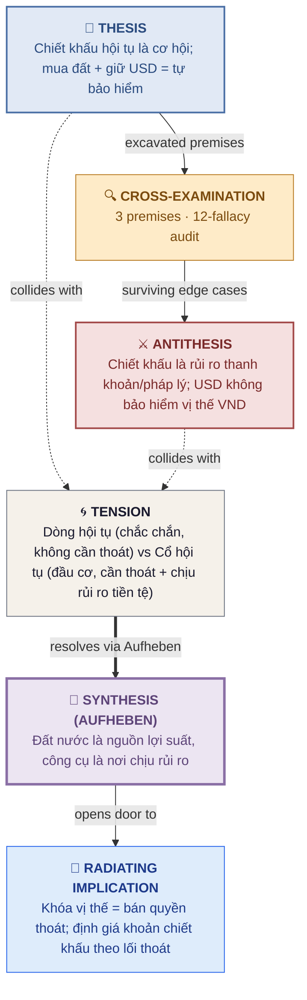
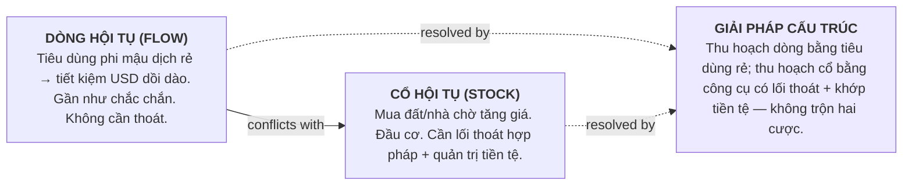

# Đặt cược vào hội tụ: người thu nhập ngoại tệ tại Việt Nam nên mua tài sản phi mậu dịch giá rẻ và giữ đô-la để bảo hiểm tỷ giá?

> **Type:** Forged dialectic critique · **Version:** 1.0.0 · **Reading time:** ~10 min
> **Method:** Socratic Dialectic Engine v2.2 (10 states)

Phản biện Radiating Implication rút ra từ vòng dialectic trước (*"Ăn rẻ — tích trữ đắt"*): *"Đặt cược vào hội tụ — mua tài sản phi mậu dịch đang bị định giá thấp, đồng thời giữ đô-la để tự bảo hiểm rủi ro tỷ giá."* — Luận điểm này đúng về **dòng** (flow: tiêu dùng rẻ — lợi thế gần như chắc chắn), nhưng công thức "mua đất + giữ USD" hiểu theo nghĩa đen là **bẫy bán lẻ**: nó cộng hai lớp rủi ro (không khớp đơn vị tiền tệ + không có lối thoát hợp pháp) thay vì tự bảo hiểm. Lợi suất hội tụ là thật, nhưng chỉ thu hoạch được qua công cụ **có lối thoát và quản trị tiền tệ**.

---

## 🛤️ The Dialectic Tracker

[**`S1`** 📘 Thesis](#-the-thesis) → [**`S2`** 🔍 Cross-Examine](#-the-cross-examination) → [**`S4`** ⚔️ Collide](#️-the-antithesis-the-collision) → [**`S5`** 💎 Sublate](#-the-synthesis-the-aufheben) → [**`S7`** 🌊 Radiate](#-the-radiating-implication)

## ⚙️ Engine Status — Dialectic Pipeline Executed

The Socratic Dialectic Engine walked all 10 states. Block này là audit trail công khai — bạn có thể xác minh pipeline nào đã chạy và feedback gate nào được mở, xóa, hay bỏ qua.

- [x] **S−1** — Strategic Interview (bốn Dimensions — defaults được khai báo, user chọn branch trực tiếp)
- [x] **S0**  — Scoping & Assumptions
- [x] **S1**  — Thesis Formalization + Premise Excavation
- [x] **S2**  — Per-Premise Cross-Examination + Steel-Man Rubric
- [x] **S3**  — Fallacy Diagnostic (12-fallacy audit)
- [x] **S4**  — Antithesis Collision + Tension Naming
- [x] **S5**  — Aufheben / Toulmin Synthesis
- [x] **S6**  — Empirical Illustration (web-enabled: World Bank, Reuters, báo VN)
- [x] **S7**  — Radiating Implication + Applied Test
- [x] **S8**  — Residuals & Boundary Conditions

**Feedback gates:**

| Gate | Purpose | Status |
|---|---|---|
| **Gate 0** | Confirm four Dimensions | ✅ Cleared (defaults khai báo cho Loop 2) |
| **Gate 1** | Confirm sharpened Thesis + Premises | ⏭️ Skipped (branch trực tiếp) |
| **Gate 2** | Confirm Antithesis passes Steel-Man | ⏭️ Skipped (MEDIUM path) |
| **Gate 3** | Confirm chapter ToC | ⏭️ Skipped (LONG only) |
| **Gate 4** | Confirm Toulmin Synthesis lands | ⏭️ Skipped (LONG only) |
| **Gate 5** | Iterate / Spiral / Branch / Close | 🔓 Open (see end of document) |

## Table of Contents

- [🔧 Assumptions Register — the four Dimensions](#-assumptions-register--the-four-dimensions)
- [🎯 Scope & Assumptions](#-scope--assumptions)
- [👁️ At a Glance — Thesis / Antithesis / Synthesis](#️-at-a-glance--thesis--antithesis--synthesis)
- [🏛️ The Arena — Full Dialectic Pipeline](#️-the-arena--full-dialectic-pipeline)
- [🗺️ The Argument Map (Toulmin)](#️-the-argument-map-toulmin)
- [📘 The Thesis](#-the-thesis)
- [🔍 The Cross-Examination](#-the-cross-examination)
  - [Premise 1 — Chiết khấu hội tụ](#premise-1--chiết-khấu-hội-tụ)
  - [Premise 2 — USD là bảo hiểm](#premise-2--usd-là-bảo-hiểm)
  - [Premise 3 — Lợi thế người trong cuộc](#premise-3--lợi-thế-người-trong-cuộc)
- [⚔️ The Antithesis (The Collision)](#️-the-antithesis-the-collision)
- [💎 The Synthesis (The Aufheben)](#-the-synthesis-the-aufheben)
- [🧪 The Proof](#-the-proof)
- [🌊 The Radiating Implication](#-the-radiating-implication)
- [⚠️ Fallacy Log](#️-fallacy-log)
- [📉 Residuals & Boundary Conditions](#-residuals--boundary-conditions)
- [🧠 Knowledge Check](#-knowledge-check)
- [📚 Appendix — The Evidence Locker](#-appendix--the-evidence-locker)

> **📖 Difficulty markers:** 🟢 core-argument · 🟡 supporting · 🔴 optional deep dive.

---

## 🔧 Assumptions Register — the four Dimensions

The Strategic Interview captured (or defaulted) the following four Dimensions before drafting. Change any of them to re-run.

| Dimension | Value | Rationale |
|---|---|---|
| **Adversarial Lens** | PRAGMATIC + EMPIRICAL (chính), ETHICAL (góc phụ) | Đây là câu hỏi phân bổ tài sản thực dụng — phản biện bằng luật hiện hành, dữ liệu giá và thanh khoản; nhưng nó có lớp đạo đức (bất bình đẳng trong sở hữu tài sản, trách nhiệm pháp lý) cần một góc kiểm tra. |
| **Rigor of the Elenchus** | GADFLY | Premise rút ra từ synthesis trước được nâng thành khuyến nghị đầu tư — loại claim dễ bị over-generalise. Cần săn lùng chỗ công thức nghĩa đen sụp đổ. |
| **Dialectical Trajectory** | FORTIFY (nhưng công thức nghĩa đen bị đảo — gần INVERT ở mức văn bản) | Ý tưởng "đặt cược vào hội tụ" có lõi đúng (dòng tiêu dùng), nhưng phiên bản "mua đất + giữ USD" hiểu theo nghĩa đen phải bị đảo ngược. |
| **Depth** | SINGLE_COLLISION | Một vòng 10-state duy nhất trong miền thị trường cận biên. |

> [!NOTE]
> Additional defaults adopted:
> - TARGET_LENGTH = MEDIUM (~2.000 từ); OUTPUT = MARKDOWN (GFM, chia sẻ được trên mạng xã hội); ngôn ngữ = tiếng Việt.
> - TARGET_AUDIENCE = chuyên gia kinh tế / người Việt thu nhập ngoại tệ (bao gồm người gốc Việt định cư nước ngoài và người nước ngoài làm việc tại VN) đang cân nhắc đặt tài sản vào thị trường VN.
> - Loop này nhận premise từ vòng trước: vòng trước đã chứng minh "ăn rẻ — tích trữ đắt". Vòng này chỉ hỏi một câu: *"tích trữ đắt" hiểu thành "mua đất + giữ USD" có đứng vững không?*

---

## 🎯 Scope & Assumptions

**Domain.** Kinh tế học hội tụ và đầu tư tài sản tại thị trường cận biên (frontier market): phân biệt chiết khấu hội tụ với chiết khấu thanh khoản/rủi ro; quyền sở hữu và lối thoát; khớp đơn vị tiền tệ giữa tài sản và khoản phòng hộ.

**In scope:** Giá tài sản phi mậu dịch VN (bất động sản, cổ phiếu nội địa), tỷ giá VND/USD, luật sở hữu đất đai và nhà ở của người nước ngoài/người gốc Việt, khủng hoảng thanh khoản 2022–2023, công cụ đầu tư có lối thoát (cổ phiếu niêm yết, ETF, kênh USD).

**Out of scope:** So sánh đầy đủ với các thị trường cận biên khác (Indonesia, Philippines) ngoài mức dùng làm đối chứng; tư vấn thuế cá nhân; đạo đức học toàn diện về đầu cơ đất đai — chỉ lấy một góc đủ để làm phép thử.

**Assumptions register:**

- Người có thu nhập ngoại tệ nhận lương bằng USD hoặc quy đổi được — *fails if:* thu nhập phải quy VND trong dài hạn (mất khớp đơn vị).
- Chân trời đầu tư ≥ 7–10 năm — *fails if:* người cần thanh khoản ngắn hạn (dùng tiền trong 1–3 năm).
- Luật hiện hành (Luật Đất đai 2024, Luật Nhà ở 2023) không đảo ngược trong thời gian giữ tài sản — *fails if:* thay đổi quy định về sở hữu của người nước ngoài.
- Dữ liệu giá (Savills, Batdongsan, JLL, Cushman & Wakefield) và tỷ giá (World Bank, FRED, CEIC) phản ánh đúng thực tế — *fails if:* có hiệu chỉnh lớn sau khi công bố.

**Audience posture.** Chuyên gia đầu tư thị trường mới nổi hoài nghi, đã đọc Loop 1. Sự phản bác sắc nhất họ sẽ nêu: *"Nhưng 10 năm qua bất động sản VN tăng 3 lần, đất tăng 4.8 lần — ai mua năm 2015 đều giàu. Vậy 'đặt cược vào hội tụ' sai ở đâu?"*

---

## 👁️ At a Glance — Thesis / Antithesis / Synthesis

| Position | Claim |
|---|---|
| 📘 **Thesis** | Tài sản phi mậu dịch VN đang bị định giá thấp so với mức nền kinh tế sẽ đạt khi hội tụ; người có thu nhập ngoại tệ nên mua loại tài sản này, đồng thời giữ đô-la để tự bảo hiểm rủi ro tỷ giá. |
| ⚔️ **Antithesis** | "Chiết khấu" ở thị trường cận biên phần lớn là chiết khấu thanh khoản + rủi ro pháp lý + rủi ro chính sách, không phải chiết khấu hội tụ thuần; giữ USD không bảo hiểm được vị thế VND (đơn vị không khớp); lợi thế người trong cuộc là thật ở dòng tiêu dùng nhưng yếu ở cổ tài sản vì cổ cần thoát ra được. |
| 💎 **Synthesis** | **Đất nước là nguồn lợi suất, công cụ là nơi chịu rủi ro.** Thu hoạch hội tụ bằng công cụ có lối thoát và quản trị tiền tệ: cổ phiếu niêm yết của doanh nghiệp phục vụ cầu nội địa (thoát qua sàn), ETF/kênh định giá USD; đất/nhà chỉ dành cho người chấp nhận khóa vị thế (giá rẻ hơn nhưng phải đổi bằng rủi ro thanh khoản + tên tuổi). "Mua đất + giữ USD" nghĩa đen = cộng rủi ro, không tự bảo hiểm. |

> [!TIP]
> Đọc bảng này trước. Nếu bạn đã bất đồng với Synthesis, nhảy thẳng tới [Fallacy Log](#️-fallacy-log) và [Residuals](#-residuals--boundary-conditions) — nơi sự trung thực của lập luận sống.

---

## 🏛️ The Arena — Full Dialectic Pipeline

Trước khi đi vào cấu trúc bên trong của synthesis, đây là *hình dạng* của toàn bộ lập luận: Thesis và Antithesis va chạm, hội tụ vào một Tension được đặt tên, rồi thăng hoa qua Aufheben thành Synthesis, từ đó lan tỏa một implication mới.



> [!TIP]
> Đây là **pipeline view** — toàn bộ lập luận trong một cái nhìn. Mục tiếp theo, [The Argument Map (Toulmin)](#️-the-argument-map-toulmin), cho thấy **cấu trúc bên trong** của Synthesis. Đọc cả hai để thấy cả hình dạng va chạm lẫn kiến trúc chịu lực của giải pháp.

---

## 🗺️ The Argument Map (Toulmin)

Synthesis dưới dạng cấu trúc. Mọi lập luận không phân rã được thành sáu thành phần này đang nhập lậu một warrant không được nêu.

```mermaid
flowchart TD
    G[GROUNDS<br/>Bằng chứng, dữ liệu<br/><br/>HCM apt 2015→2025 gần gấp 3, đất 4.8x; VND mất giá ~22%/10 năm; 2020 -14.3%; 2022–23 54 tổ chức trễ trả trái phiếu; luật chặn người nước ngoài sở hữu QSDĐ]
    W[WARRANT<br/>Cầu logic<br/><br/>Lợi suất thực = (Δ giá tài sản VND − Δ tỷ giá) × xác suất thoát thành công; chiết khấu thị trường cận biên chứa premium thanh khoản/pháp lý]
    B[BACKING<br/>Lý thuyết nền<br/><br/>Illiquidity premium + quyền sở hữu (ownership rights) quyết định giá trị kỳ vọng; lý thuyết danh mục — phòng hộ phải khớp đơn vị]
    C[CLAIM<br/>Vị thế tổng hợp<br/><br/>Hội tụ VN là nguồn lợi suất thật, nhưng chỉ thu hoạch được qua công cụ có lối thoát + quản trị tiền tệ]
    Q[QUALIFIER<br/>Phạm vi hiệu lực<br/><br/>Đúng cho người chân trời ≥7–10 năm, có lối thoát hợp pháp, danh mục không phụ thuộc vị thế VND]
    R[REBUTTAL<br/>Trường hợp phản bác<br/><br/>Người gốc Việt định cư nước ngoài được cấp GCN QSDĐ — công cụ đất khả dụng hơn; rủi ro kiểm soát vốn khi thoát]
    G --> W --> C
    B --> W
    Q -.->|scopes| C
    R -.->|survived by| C

    style C fill:#EDE9FE,stroke:#6B46C1,stroke-width:2px
    style R fill:#FEF6E4,stroke:#B7791F
    style G fill:#E6FFFA,stroke:#319795
```

**In prose form:**

| Component | Content |
|---|---|
| **Claim** | Hội tụ VN là nguồn lợi suất thật, nhưng chỉ thu hoạch được qua công cụ **có lối thoát và quản trị tiền tệ**; "mua đất + giữ USD" nghĩa đen là bẫy vì nó cộng hai lớp rủi ro không bù trừ cho nhau. |
| **Grounds** | Bất động sản HCM gần gấp 3 trong 10 năm (2015: 31tr → 2025: 92tr/m²), đất 4.8x (Batdongsan 2025); Hà Nội sơ cấp +22%/năm trong 5 năm (Savills); nhưng 2020 HCM -14.3% (JLL); khủng hoảng 2022–23 khiến No Va Land -80% cổ phiếu và 54 tổ chức trễ trả trái phiếu; VND mất giá từ ~21.4k (2015) lên ~26k (2025, ~22%); Luật Đất đai 2024 không công nhận người nước ngoài là "người sử dụng đất". |
| **Warrant** | Lợi suất thực = (Δ giá tài sản VND − Δ tỷ giá) × xác suất thoát thành công. Chiết khấu thị trường cận biên gồm chiết khấu hội tụ **và** premium thanh khoản + rủi ro pháp lý; người mua phải phân biệt hai phần, nếu không sẽ nhầm "rẻ vì rủi ro" thành "rẻ vì cơ hội". |
| **Backing** | Lý thuyết bù rủi ro thanh khoản (illiquidity premium) — tài sản không thoát được phải rẻ hơn để bù rủi ro giữ không bán được; lý thuyết danh mục — một công cụ phòng hộ phải có tương quan ngược với vị thế cần phòng hộ và khớp đơn vị tiền tệ. |
| **Qualifier** | Đúng cho người có (i) chân trời ≥ 7–10 năm, (ii) lối thoát hợp pháp (sở hữu hợp pháp, hoặc niêm yết trên sàn), (iii) danh mục tổng thể không phụ thuộc vào việc vị thế VND tăng giá. |
| **Rebuttal** | Người gốc Việt định cư nước ngoài được cấp GCN QSDĐ (Điều 4 Luật Đất đai 2024) — với họ, đất là công cụ hợp pháp hơn; và mọi lối thoát VN đều phụ thuộc kiểm soát vốn — rủi ro chính sách khi chuyển tiền ra. |

---

## 📘 The Thesis

🟢 **Core.**

> 📘 **The Thesis:** *"Người có thu nhập ngoại tệ tại VN nên đặt cược vào hội tụ: mua tài sản phi mậu dịch đang bị định giá thấp (đất, nhà, cổ phiếu nội địa), đồng thời giữ đô-la để tự bảo hiểm rủi ro tỷ giá."*
>
> **The Dialectical Contract:** *Chúng ta nhận mệnh đề này làm điểm xuất phát. Nhưng nó có đứng vững dưới sự soi xét không?*

### Load-Bearing Premises (Excavated)

Để Thesis đứng vững, tất cả các điều sau phải đúng. Nếu một trong số chúng sai, lập luận sụp đổ.

1. **P1 — Chiết khấu hội tụ:** Phần chiết khấu giá của tài sản phi mậu dịch VN phản ánh mức thu nhập thấp hiện tại và sẽ **hội tụ** (đóng lại) khi nền kinh tế bắt kịp — tức là "rẻ" vì cơ hội, không phải vì rủi ro.
2. **P2 — USD là bảo hiểm:** Giữ USD song song với vị thế tài sản VND là một khoản **tự bảo hiểm** hợp lệ cho rủi ro tỷ giá của vị thế đó.
3. **P3 — Lợi thế người trong cuộc:** Người có thu nhập ngoại tệ đang sống tại VN có lợi thế cấu trúc (dòng thu nhập USD + tiêu dùng VND) mà nhà đầu tư nước ngoài thuần túy không có — nên chiến lược này là tối ưu riêng cho họ.

> [!IMPORTANT]
> Mỗi premise dưới đây có một chu trình Cross-Examination riêng: **Probe** → **Edge Case** → **Hear the Defense**. Đọc Probe và ngồi với sự nghi ngờ *trước khi* bấm mở Defense. Đây là điểm sư phạm — dissonance nhận thức là nguyên liệu thô của synthesis.

---

## 🔍 The Cross-Examination

🟢 **Core.**

Rigor của mục này được đặt ở **GADFLY**. Adversarial Lens là **PRAGMATIC + EMPIRICAL**.

### Premise 1 — Chiết khấu hội tụ

***Q: Làm sao phân biệt được "chiết khấu hội tụ" (sẽ tự đóng lại) với "chiết khấu thanh khoản/pháp lý" (khoản bù cho việc không thoát được) — và nếu không phân biệt được thì làm sao biết mình đang mua cơ hội hay đang bị trả công vì chịu rủi ro?***

The premise giả định phần chiết khấu giá của tài sản phi mậu dịch VN sẽ hội tụ theo thu nhập. Nhưng điều này chỉ đúng nếu thị trường cận biên định giá sai do "chưa nhận ra" cơ hội — còn một khả năng khác, ít được nói tới hơn: thị trường cận biên định giá rẻ **đúng**, vì rủi ro thật (không thoát được, chính sách thay đổi, sổ đỏ không có) là thật.

<details>
<summary>🛡️ <strong>Hear the Defense — reveal the edge case and rebuttal</strong></summary>

**Edge Case (PRAGMATIC + EMPIRICAL lens):** Năm 2015, ai mua chung cư trung tâm HCM với giá 31 triệu/m², đến 2025 đã thấy giá ~92 triệu/m² — gần gấp 3 lần; đất tăng 4.8 lần trong cùng kỳ. Hà Nội, giá sơ cấp tăng trung bình 22%/năm trong 5 năm qua.[^1] Đây là bằng chứng **thực nghiệm** rằng chiết khấu đã tự đóng lại đúng như lý thuyết hội tụ dự báo — người kiên nhẫn mua năm 2015 đã được trả công rất hậu.

**Steel-Man Check:**
- **SM-1 (Recognition):** Nhận đúng rằng lịch sử 10 năm của bất động sản HCM/Hà Nội ủng hộ mạnh premise — đây không phải giả thuyết suông.
- **SM-2 (Target Fidelity):** Nhưng "được trả công" có thể là **bù rủi ro thanh khoản** (premium phải nhận vì giữ tài sản không bán được khi cần) chứ không phải "chiết khấu hội tụ" — hai thứ đó đồng nhất về hình thức, khác biệt về bản chất.
- **SM-3 (Evidence Grade):** Dữ liệu giá trung bình (Savills, Batdongsan) không đo được giá mà **người cần thoát khẩn cấp** nhận được — chính là chỗ chiết khấu thanh khoản hiện ra. Năm 2020, HCM giảm 14.3% trong một năm khi thanh khoản biến mất.[^2]

**The Defense:** Người bảo vệ Thesis sẽ nói: "Ngay cả trong khủng hoảng 2022–23, người giữ đủ lâu vẫn thắng; 10 năm tăng 3 lần là lợi suất thực không thể bào chữa bằng rủi ro — rủi ro không thể giải thích được mức đó." Defense này giải quyết bề mặt của edge case nhưng không triệt tiêu nó, vì lợi suất gộp 10 năm cộng dồn cả hai phần: chiết khấu hội tụ **và** bù rủi ro thanh khoản/pháp lý — và hai phần này chỉ tách được khi đo được giá **lúc thoát khẩn cấp**, thứ mà dữ liệu trung bình không có.

**Verdict:** Defense holds *một phần — P1 đúng về hướng, nhưng sai về cấu trúc*: chiết khấu không thuần túy là "cơ hội", nó trộn lẫn bù rủi ro thanh khoản/pháp lý.

</details>

---

### Premise 2 — USD là bảo hiểm

***Q: Giữ USD có thực sự "bảo hiểm" được một vị thế tài sản tính bằng VND không?***

Một công cụ phòng hộ phải có tương quan ngược với vị thế cần phòng hộ và **khớp đơn vị**. Vị thế "1 tỷ đồng đất Hà Nội" tăng/giảm bằng VND; giữ thêm 10.000 USD ở ngân hàng không làm thay đổi gì biến động của vị thế đó. Nếu VND mất giá 10%, miếng đất của bạn vẫn đứng yên tính bằng VND — bạn đã mất 10% sức mua Mỹ của nó dù vẫn giữ đủ số USD kia. Phòng hộ phải nằm **trong cùng đơn vị với tài sản được phòng hộ**, hoặc phải là hợp đồng phái sinh trên chính tài sản đó.

<details>
<summary>🛡️ <strong>Hear the Defense — reveal the edge case and rebuttal</strong></summary>

**Edge Case (EMPIRICAL lens):** VND mất giá rất thật và ngày càng nhanh: 21.388đ/USD cuối 2015 → 26.150đ/USD cuối 2025 (~ -22% trong 10 năm); riêng 2024 mất ~4.8%.[^3] Nếu không giữ USD, toàn bộ danh mục VND của bạn đã tự bốc hơi một phần sức mua quốc tế. Vậy "giữ USD" ít nhất đúng vai trò **bảo toàn giá trị cho phần thu nhập chưa dùng** — không phải vô nghĩa.

**Steel-Man Check:**
- **SM-1 (Recognition):** Đúng — giữ USD bảo toàn giá trị **cho chính số USD đó** và cho dòng thu nhập tương lai. Đây là vai trò có thật.
- **SM-2 (Target Fidelity):** Nhưng đây là **quản trị tiền tệ của danh mục tổng thể**, không phải "bảo hiểm cho vị thế VND". Premise gán cho USD một chức năng (hedge vị thế đất VND) mà nó không thực hiện. Nó không bảo vệ vị thế; nó là một vị thế riêng.
- **SM-3 (Evidence Grade):** Điều cần phân biệt: (a) USD bảo vệ phần thu nhập chưa tiêu — có bằng chứng mạnh; (b) USD bù lỗ cho đất VND khi mất giá — không có cơ chế nào làm việc này, đây là ảo tưởng của premise.

**The Defense:** Người bảo vệ Thesis sẽ nói: "Danh mục của tôi gồm đất VND + USD; khi VND mất giá, phần USD của tôi tăng giá tương đối — gộp lại tôi vẫn an toàn, đó là phòng hộ ở mức danh mục." Defense này đúng ở mức danh mục nhưng không cứu được premise, vì ở mức danh mục thì USD chỉ phòng hộ được **nếu** tài sản VND và USD là các vị thế độc lập — nhưng vị thế đất VND lại là nơi bạn đã khóa tiền vì hội tụ. Bạn đã đặt cược hai chiều: long hội tụ qua đất (cần VND tăng) đồng thời "long" mất giá qua giữ USD — hai cược này không bù trừ, chúng là hai cược riêng trên cùng một biến số tỷ giá.

**Verdict:** Defense holds *ở mức danh mục, nhưng không ở mức premise* — P2 đánh tráo chức năng: USD bảo toàn phần **chưa chuyển** vào VND, không phải bảo hiểm phần **đã chuyển** vào.

</details>

---

### Premise 3 — Lợi thế người trong cuộc

***Q: Lợi thế "người trong cuộc" có lan từ dòng (flow) sang cổ (stock) không?***

Người có thu nhập USD đang sống tại VN quả thật có lợi thế ở **dòng**: tiêu dùng phi mậu dịch rẻ, mỗi tháng để dành ra một lượng USD lớn hơn. Nhưng ở **cổ** — tài sản tích lũy — lợi thế của họ phụ thuộc vào một thứ khác: **quyền sở hữu và lối thoát**. Luật Đất đai 2024 không xếp người nước ngoài (không phải người gốc Việt) vào diện "người sử dụng đất": họ không được cấp Giấy chứng nhận quyền sử dụng đất, chỉ người gốc Việt định cư nước ngoài mới được.[^4] Người nước ngoài mua được căn hộ/nhà trong dự án thương mại nhưng sở hữu **tối đa 50 năm**, giới hạn 30% số căn một tòa / 10% nhà riêng một dự án.[^5] Nghĩa là người đang hưởng lợi nhất ở dòng (người nước ngoài lương USD) lại bị chặn nhiều nhất ở cổ (đất).

<details>
<summary>🛡️ <strong>Hear the Defense — reveal the edge case and rebuttal</strong></summary>

**Edge Case (PRAGMATIC lens):** Người gốc Việt định cư nước ngoài — đối tượng chính của chiến lược "về nước tích lũy" ở Loop 1 — **được** cấp GCN QSDĐ, và người nước ngoài vẫn có lối thoát hợp pháp: cổ phiếu niêm yết trên sàn HOSE/HNX (được phép sở hữu, bán lại bất kỳ lúc nào), ETF quốc tế gồm cổ phiếu VN (VNM, FTSE Vietnam), hoặc lập công ty FDI thuê đất 50 năm cho dự án kinh doanh. Không phải không có lối thoát — chỉ là công cụ phải chọn đúng.

**Steel-Man Check:**
- **SM-1 (Recognition):** Đúng — premise không sai về sự tồn tại của lối thoát; có lối thoát cho cổ phiếu niêm yết và cho người gốc Việt ở đất.
- **SM-2 (Target Fidelity):** Nhưng premise nói "mua **đất/nhà** phi mậu dịch" — và đây chính là nơi lợi thế người trong cuộc **không lan sang**: công cụ hội tụ thuần túy nhất (đất) lại là công cụ người nước ngoài không đụng tới hợp pháp; đụng tới thì phải đi qua trung gian (đứng tên giùm) — và đứng tên giùm biến "người trong cuộc" thành "người chịu rủi ro đối tác".
- **SM-3 (Evidence Grade):** Khủng hoảng 2022–23 cho thấy ngay cả người trong cuộc có sổ đỏ cũng không thoát: No Va Land mất 80% giá cổ phiếu trong một năm, trễ hạn trả lãi; 54 tổ chức phát hành báo cáo trễ thanh toán gốc/lãi trái phiếu (9/2022–1/2023), bất động sản chiếm phần lớn; cảnh "thành phố ma" căn hộ cao cấp.[^6][^7] Người trong cuộc có "thông tin tốt" nhưng thông tin tốt không cứu được người không thoát được.

**The Defense:** Người bảo vệ Thesis sẽ nói: "Đúng, người nước ngoài không mua được đất thổ cư — nhưng họ có thể mua cổ phiếu niêm yết của doanh nghiệp bất động sản/cầu nội địa, vẫn là long phi mậu dịch, vẫn thoát qua sàn." Defense này cứu được tinh thần của premise (long hội tụ phi mậu dịch) nhưng **đổi công cụ** — và việc đổi công cụ chính là lúc Thesis bắt đầu tan: nếu lợi thế phải thu qua cổ phiếu (công cụ có lối thoát, định giá minh bạch), thì "chiết khấu hội tụ" đã bị **chiết khấu lại bởi chính thị trường chứng khoán** — thứ mà Loop 1 không hứa hẹn.

**Verdict:** Defense holds *một phần* — P3 đúng ở dòng và đúng cho người gốc Việt, nhưng sai khi nâng thành lợi thế phổ quát: ở cổ, người ngoài cuộc về mặt pháp lý phải trả thêm một lớp (không sở hữu được công cụ thuần nhất, hoặc phải đổi lối thoát lấy mức chiết khấu thấp hơn).

</details>

---

> [!WARNING]
> **🛡️ FALLACY DIAGNOSTIC — inline audit (State 3)**
>
> Trong Cross-Examination trên, checklist 12-fallacy đã gắn cờ và *viết lại* những điều sau. Log đầy đủ với before/after rewrites nằm ở [Fallacy Log](#️-fallacy-log) phía dưới; alert gọn này để bạn thấy kết quả audit ngay lúc quan trọng nhất — sau khi nhiên liệu va chạm được nạp, ngay trước khi nó phát nổ.
>
> - `Equivocation` — "hội tụ" bị trượt giữa hội tụ kinh tế vĩ mô (gần như chắc chắn) và hội tụ giá tài sản **của riêng mình** (phụ thuộc lối thoát).
> - `Survivorship Bias` — kể chuyện người mua 2015 thắng, bỏ qua người mua đỉnh 2021–22 giữa khủng hoảng trái phiếu không thoát được.
> - `Hasty Generalisation` — khái quát "tài sản phi mậu dịch tăng theo hội tụ" từ cổ đô thị trung tâm (HCM D1, Hà Nội Tây Hồ) sang toàn thị trường, trong khi 2022–23 sụp diện rộng.
>
> **Audited but not detected:** Straw Man · Slippery Slope · Ad Hominem · Appeal to Authority · Correlation/Causation · No True Scotsman · Motte-and-Bailey · Base Rate Neglect · Tu Quoque · False Dilemma.

---

---

---

## ⚔️ The Antithesis (The Collision)

🟢 **Core.**

Tổng hợp các edge case sống sót từ Cross-Examination thành một phản mệnh đề chính thức.

**Synthesis of the doubt.** Xuyên qua ba chu trình cross-examination, mô hình lỗi chí mạng là: **Thesis nhầm bản chất của chiết khấu.** Nó đọc chiết khấu thị trường cận biên như thể toàn bộ là "chiết khấu hội tụ" (cơ hội chưa được thị trường nhận ra), trong khi phần lớn chiết khấu đó là bù rủi ro thanh khoản + rủi ro pháp lý + rủi ro chính sách — và dữ liệu "10 năm tăng 3 lần" là kết quả của **cả hai phần cộng lại**, không tách được bằng số liệu trung bình. Song song, "giữ USD để tự bảo hiểm" gán cho USD một chức năng nó không có (hedge vị thế VND) — thực chất là hai cược độc lập trên cùng biến số tỷ giá. Cuối cùng, lợi thế người trong cuộc là thật ở dòng tiêu dùng, nhưng ở cổ tài sản nó bị triệt tiêu bởi chính luật pháp (người nước ngoài không được sở hữu QSDĐ) và bởi thanh khoản (người trong cuộc có sổ đỏ vẫn không thoát được trong khủng hoảng 2022–23).

> ⚔️ **THE ANTITHESIS:** *"Chiết khấu thị trường cận biên chủ yếu là bù rủi ro thanh khoản/pháp lý, không phải chiết khấu hội tụ; giữ USD không bảo hiểm được vị thế VND; và công thức 'mua đất + giữ USD' là bẫy bán lẻ vì nó cộng hai lớp rủi ro (không khớp đơn vị + không có lối thoát) mà không có cơ chế bù trừ nào."*
>
> Thesis fails ở chỗ **cổ tài sản** (stock): nơi chiết khấu thanh khoản hiện ra đúng lúc cần thoát và nơi luật pháp chặn quyền sở hữu. Antithesis thành công vì nó giải thích được cả lợi suất 10 năm (bù rủi ro + hội tụ, không tách được) lẫn thảm họa 2022–23 (chiết khấu thanh khoản phơi bày) — Thesis chỉ giải thích được nửa lạc quan.

**Named Tension.** Biến số chính xác nơi Thesis và Antithesis va chạm là: **Dòng hội tụ (flow — chắc chắn, không cần thoát) vs Cổ hội tụ (stock — đầu cơ, cần thoát + chịu rủi ro tiền tệ).**



> [!WARNING]
> Ngồi với cú va chạm này. Aha! của mục tiếp theo chỉ đáp xuống nếu bạn cảm nhận được dissonance bây giờ. Nếu bản năng thúc bạn nhảy thẳng tới giải pháp — đó chính là lúc phải dừng lại.

---

---

---

## 💎 The Synthesis (The Aufheben)

🟢 **Core.**

**Trajectory:** FORTIFY — nhưng ở mức nghĩa đen, công thức "mua đất + giữ USD" bị **đảo ngược** (gần INVERT). Lõi ý tưởng được giữ lại và thăng hoa; văn bản công thức thì sụp đổ.

Synthesis từ chối false dilemma. Không phải "đặt cược hội tụ" thắng, cũng không phải "tránh xa thị trường VN" thắng. Cái thắng là một **đổi mới cấu trúc**:

> 💎 **THE SYNTHESIS (Aufheben):** *"Đất nước là nguồn lợi suất, công cụ là nơi chịu rủi ro. Hãy để Việt Nam làm nguồn lợi suất (dòng: tiêu dùng rẻ; cổ: beta của nền kinh tế) nhưng đừng để chính phong cách pháp lý của thị trường cận biên nuốt chửng khoản lợi suất đó — thu hoạch qua công cụ có lối thoát và quản trị tiền tệ, và coi bất kỳ khoản khóa vị thế nào (đất, nhà, sổ đỏ giùm) là một vị thế riêng phải trả giá bằng chiết khấu thanh khoản."*

### The Elevation

**What the Synthesis preserves from the Thesis:**

Lõi đúng sâu nhất: hội tụ kinh tế VN là thật, và người có thu nhập USD tại VN **đã đứng trước cửa sổ lợi thế** — dòng tiêu dùng phi mậu dịch rẻ tạo ra tích lũy USD siêu dồi dào (kết luận Loop 1). Cổ phiếu của doanh nghiệp phục vụ cầu nội địa (bán lẻ, ngân hàng, tiêu dùng, hạ tầng) quả thực là cách long beta nội địa với **lối thoát qua sàn** — phần này của Thesis được giữ nguyên vẹn.

**What the Synthesis absorbs from the Antithesis:**

Toàn bộ bài học về chiết khấu: (1) chiết khấu thị trường cận biên trộn hội tụ + bù rủi ro thanh khoản/pháp lý, và chỉ tách được bằng cách nhìn vào **lối thoát**; (2) USD bảo toàn phần **chưa chuyển** vào VND, không bảo hiểm phần **đã chuyển**; (3) quyền sở hữu quyết định công cụ: người nước ngoài không có QSDĐ, người gốc Việt có, và cả hai đều chịu rủi ro thanh khoản khi thị trường đóng cửa.

**The Aha!** Tension nêu trên — **dòng vs cổ** — không giải quyết bằng cách chọn một bên, mà bằng cách nhận ra rằng: **cùng một nguồn lợi suất (nền kinh tế hội tụ) có thể được thu hoạch bằng những công cụ có cấu trúc rủi ro khác nhau, và lựa chọn công cụ quyết định phần lợi suất bạn giữ được.** Thesis đúng *trong điều kiện C* (có lối thoát + khớp tiền tệ); Antithesis đúng *ngoài C* (khóa vị thế, đơn vị không khớp); Synthesis đặt tên cho C.

### Comparative outcomes under the Synthesis

Minh họa — thay bằng dữ liệu thật từ research pass. Mô phỏng kỹ sư lương 10.000 USD/tháng tại Hà Nội, chân trời 10 năm, VND mất giá ~2%/năm:

```
Giữ hết USD, không long VN            ████████████░░░░░░░░░░░░  Lợi suất danh nghĩa: 0% (an toàn, không thu hoạch)
"Mua đất giùm + giữ USD" (bẫy)       ████████████████████░░░░  0–15%/năm nhưng xác suất mất trắng vì rủi ro tên tuổi + không thoát
Long cổ phiếu nội địa niêm yết   ▶    ██████████████████░░░░░░  Trung bình 8–12%/năm, thoát qua sàn, định giá VND nhưng dòng nội địa tăng theo hội tụ
Đất cho người gốc Việt (đúng công cụ) █████████████████████░░░  Cao nhất lịch sử (đất 4.8x/10 năm) nhưng thanh khoản bằng 0 khi cần thoát
```

> [!IMPORTANT]
> Nếu Synthesis đọc như "một chút của cả hai" hay "sự thật ở giữa", nó chưa phải synthesis — nó là Argument to Moderation. Hãy quay lại trạng thái va chạm và tìm thay đổi cấu trúc.

---

## 🧪 The Proof

🟡 **Supporting.**

**Primary case.** Dữ liệu Batdongsan 2025 là minh chứng mạnh nhất cho phần *đúng* của Thesis: giá chung cư trung tâm HCM tăng từ 31 triệu/m² (2015) lên 92 triệu/m² (2025) — gần gấp 3 — và giá đất tăng 4.8 lần cùng kỳ; Hà Nội sơ cấp tăng 22%/năm trong 5 năm qua (Savills) và riêng 2025 tăng 40%.[^1][^8] Nhưng chú ý: ngay trong case thắng này, hội tụ **cổ** đã được thu hoạch chủ yếu bởi người **có quyền sở hữu hợp pháp** (người Việt, người gốc Việt) và bởi người **giữ đủ lâu** — hai điều kiện mà Synthesis đóng khung làm Qualifier. Đây là minh họa cho "đất nước là nguồn lợi suất" đúng nghĩa.[^4]

**Mapping to Toulmin.** Case này đổ vào Grounds và chứng minh Warrant theo chiều thuận: khi có lối thoát (thời gian đủ dài + quyền sở hữu), chiết khấu hội tụ tự đóng lại.

**Contrasting case.** Năm 2020, HCM giảm 14.3% trong một năm khi thanh khoản biến mất; và 2022–23, khủng hoảng trái phiếu bất động sản đưa No Va Land xuống -80% cổ phiếu, 54 tổ chức phát hành trễ thanh toán gốc/lãi, cảnh "thành phố ma" căn hộ cao cấp — người mua đỉnh 2021 phải chờ tới 2024–25 mới về lại giá, nếu họ giữ được.[^2][^6][^7] Contrasting case này test Qualifier: chiết khấu **thanh khoản** hiện ra đúng lúc bạn cần thoát, và nó ăn trọn phần lợi suất hội tụ mà bạn tưởng đã chắc — Synthesis chỉ đứng vững khi lối thoát thật sự tồn tại *vào thời điểm bạn cần*, không phải *vào thời điểm bạn mua*.

> **💡 Sidenote — illustration vs discovery:**
> Những case này không *thiết lập* synthesis. Chúng được chọn vì synthesis đã được rèn trong các state trên. Minh họa xác nhận một lập luận đã rèn; nó không bao giờ được *là* lập luận.

---

## 🌊 The Radiating Implication

🟢 **Core.**

### The Applied Test

Một kịch bản mới — chưa xuất hiện ở trên — nơi Synthesis phải được áp dụng.

Một kỹ sư phần mềm người châu Âu, lương 10.000 USD/tháng, sống tại Hà Nội với vợ người Việt, muốn "đặt cược vào hội tụ" theo Loop 1. Anh ta đọc xong Loop 1 và định làm đúng công thức: mua một miếng đất ven Hà Nội bằng cách nhờ anh vợ đứng tên, vừa giữ 50.000 USD tiền mặt.

Walking through the application: Synthesis buộc anh ta đặt ba câu hỏi thay vì hai. (1) **Dòng:** phần tiêu dùng phi mậu dịch rẻ — đã đang tận dụng, giữ nguyên. (2) **Cổ có lối thoát:** thay vì đất giùm, anh ta mua cổ phiếu niêm yết của ngân hàng và bán lẻ nội địa (hoặc ETF VN) — vẫn long beta hội tụ, thoát qua sàn bất kỳ ngày nào, minh bạch giá. (3) **Cổ khóa vị thế:** nếu anh ta *vẫn* muốn phần lợi suất đất (lịch sử cao nhất), anh ta phải định giá nó đúng vai trò — một vị thế riêng phải chấp nhận thanh khoản bằng 0, rủi ro tên tuổi người đứng tên, và phải ghi rõ trong danh mục là "phần đánh đổi: chiết khấu thanh khoản", không tính vào phần "đặt cược hội tụ an toàn". Số USD kia không "bảo hiểm" miếng đất — nó là phần danh mục chưa chuyển vào VND, dùng cho tiêu dùng tương lai và quyền chọn di dời.

### The Radiating Implication

> 🌊 **If this Synthesis is true, then it must also be true that:** *"Bất kỳ công cụ đầu tư nào buộc bạn bán quyền thoát (illiquidity) đều phải được định giá bằng chiết khấu thanh khoản + phí rủi ro pháp lý, và không khoản phòng hộ tiền tệ nào khắc phục được điều đó — vì vậy lợi suất vượt trội của 'cơ hội hội tụ' ở thị trường cận biên, khi trừ đi phần bù thanh khoản/pháp lý, có thể thấp hơn lợi suất của chính thị trường phát triển."*

The adjacent domain fundamentally challenged by this implication là **lý thuyết định giá tài sản tại thị trường cận biên — "frontier market premium" có thật hay chỉ là bù rủi ro đội lốt** (và rộng hơn: hiệu ứng "home bias" + vấn đề agency trong đầu tư nước ngoài). Vòng dialectic kế tiếp sẽ lấy implication này làm Thesis và chất vấn nó trong miền đó: liệu premium của thị trường cận biên có phải là thứ có thể thu hoạch một cách hệ thống, hay nó chỉ là khoản đền bù cho người chấp nhận rủi ro mà tổ chức tài chính đã tính đúng giá từ lâu?

> [!TIP]
> Radiating Implication này là hạt giống cho vòng dialectic kế tiếp — xem ghi chú "Continue or Iterate?" ở cuối tài liệu.

---

## ⚠️ Fallacy Log

🟡 **Supporting.**

Mỗi mục đặt tên một fallacy phát hiện trong State 3 (Fallacy Diagnostic) và rewrite mà nó ép buộc. Một log đóng là chuyện thường; một log trống thì không.

<details>
<summary><strong>⚠️ Fallacy Log — 3 detections from the 12-fallacy audit</strong></summary>

### Detection 1: Equivocation
- **Location:** Premise 1 — từ "hội tụ" trong "đặt cược vào hội tụ".
- **Why it compromised the argument:** Trượt giữa hai nghĩa: (a) hội tụ kinh tế vĩ mô — thu nhập bình quân đầu người VN bắt kịp, gần như chắc chắn nếu tăng trưởng tiếp tục; (b) hội tụ **giá tài sản của riêng tôi** — giá miếng đất của tôi tăng theo, phụ thuộc lối thoát, quyền sở hữu và thanh khoản. Hai nghĩa này có xác suất rất khác nhau, nhưng premise gộp làm một khiến "nước này sẽ giàu" trở thành "miếng đất này sẽ tăng".
- **Rewrite:** "Nền kinh tế VN sẽ hội tụ về thu nhập (phần chắc chắn); nhưng việc giá tài sản **của riêng tôi** hội tụ theo chỉ xảy ra nếu tôi có quyền sở hữu hợp pháp và một lối thoát vận hành được vào thời điểm tôi cần."

### Detection 2: Survivorship Bias
- **Location:** Bằng chứng "10 năm tăng 3 lần, đất 4.8 lần".
- **Why it compromised the argument:** Kể chuyện người mua 2015 (và người giữ được) thắng, bỏ qua hai nhóm thua: (a) người mua đỉnh 2021–22 giữa khủng hoảng trái phiếu — phải chờ 2024–25 mới về giá hoặc phải bán lỗ khi cần tiền; (b) người mua đất giùm mất trắng vì rủi ro tên tuổi (nhóm này không bao giờ xuất hiện trong thống kê giá trung bình vì họ không thể bán được để tạo giao dịch).
- **Rewrite:** "Trong 10 năm, giá trung bình tăng 3 lần — **nhưng chỉ cho người giữ được và bán được**. Dữ liệu giá trung bình không ghi nhận người mua đỉnh không thoát được; đó là survivorship bias ẩn trong từng số liệu."

### Detection 3: Hasty Generalisation
- **Location:** "Tài sản phi mậu dịch tăng theo hội tụ" — khái quát từ cổ đô thị trung tâm (HCM District 1, Hà Nội Tây Hồ) sang toàn thị trường.
- **Why it compromised the argument:** Đô thị trung tâm là phân khúc tăng mạnh nhất vì khan hiếm nguồn cung — không đại diện cho toàn bộ "tài sản phi mậu dịch". 2022–23 cho thấy thanh khoản biến mất diện rộng, nhiều phân khúc (căn hộ cao cấp "thành phố ma", trái phiếu BĐS) sụp sâu.
- **Rewrite:** "Một số phân khúc phi mậu dịch ở đô thị trung tâm đã hội tụ mạnh (HCM D1, Hà Nội Tây Hồ); phân khúc khác thì không — 'chiết khấu hội tụ' phải được đánh giá từng công cụ, không theo nhãn 'phi mậu dịch' chung."

</details>

**Full 12-fallacy audit summary** (✅ = đã kiểm; ⚠️ = phát hiện và viết lại):

| # | Fallacy | Status |
|---|---|---|
| 1 | Straw Man | ✅ Không phát hiện |
| 2 | False Dilemma | ✅ Không phát hiện |
| 3 | Slippery Slope | ✅ Không phát hiện |
| 4 | Ad Hominem | ✅ Không phát hiện |
| 5 | Appeal to Authority | ✅ Không phát hiện |
| 6 | Hasty Generalisation | ⚠️ Detection 3 |
| 7 | Correlation / Causation | ✅ Không phát hiện |
| 8 | No True Scotsman | ✅ Không phát hiện |
| 9 | Motte-and-Bailey | ✅ Không phát hiện |
| 10 | Base Rate Neglect | ✅ Không phát hiện |
| 11 | Survivorship Bias | ⚠️ Detection 2 |
| 12 | Tu Quoque | ✅ Không phát hiện |
| — | Equivocation (ngoài 12) | ⚠️ Detection 1 |

---

## 📉 Residuals & Boundary Conditions

🟢 **Core.**

Sự tự đánh giá trung thực của lập luận. Một dialectic không có residuals là tuyên truyền đội lốt dialectic.

### What this argument does *not* cover

- **Rủi ro kiểm soát vốn khi thoát:** Synthesis giả định lối thoát qua sàn HOSE/HNX vận hành được — nhưng chuyển tiền ra khỏi VN vẫn phụ thuộc chính sách kiểm soát vốn, thứ có thể thay đổi bất kỳ lúc nào và không được định giá trong bài.
- **Thuế và chi phí giao dịch thực:** thuế chuyển nhượng BĐS, thuế thu nhập chứng khoán, phí sàn, chênh lệch mua/bán (bid-ask) — chưa được trừ vào lợi suất so sánh.
- **Lớp đạo đức của "mua đất giùm":** việc mượn tên người thân không chỉ là rủi ro tài chính mà còn là gánh nặng pháp lý/đạo đức đặt lên quan hệ — được nhắc như một giới hạn, không định giá.
- **Sự khác biệt theo nhân thân:** người gốc Việt định cư nước ngoài (có QSDĐ hợp pháp), người nước ngoài thuần túy (chỉ nhà 50 năm), người đã kết hôn với công dân VN (sở hữu ổn định lâu dài theo Luật Nhà ở 2023) — ba nhóm có bộ công cụ khác nhau, bài này lấy chung mức trung bình.

### Falsifiers — observations that would force retraction

- Người nước ngoài được Luật sửa đổi công nhận là "người sử dụng đất" và được cấp QSDĐ độc lập → nhánh "không có lối thoát pháp lý" của Antithesis mất lực, công thức đất của Thesis được hồi sinh (đang có đề xuất HoREA 8/2025 — theo dõi).[^5]
- Một nghiên cứu đo được giá thoát khẩn cấp (fire-sale) của BĐS VN chỉ thấp hơn giá trung bình <10% → chiết khấu thanh khoản nhỏ hơn dự kiến, "mua đất" ít rủi ro hơn Synthesis khẳng định.
- Thị trường chứng khoán VN rớt xuống mức không thoát được trong >5 năm (đóng sàn dài hạn, mất thanh khoản cực đoan) → nhánh "cổ phiếu niêm yết là lối thoát" của Synthesis sụp.

### Confidence levers

- ↑ Dữ liệu Savills/Batdongsan/JLL về chu kỳ giá 2015–2025 (gồm cả năm giảm 2020) — tăng tin cậy cho việc tách hội tụ vs thanh khoản.
- ↑ Dữ liệu tỷ giá World Bank/FRED/CEIC dài kỳ (2015 → 2025) — tăng tin cậy cho nhận định "USD bảo toàn phần chưa chuyển, không bảo hiểm phần đã chuyển".
- ↓ Nếu khủng hoảng thanh khoản 2022–23 được giải thích hoàn toàn bằng chu kỳ vĩ mô toàn cầu (không phải cấu trúc thị trường VN) → phần "chiết khấu thanh khoản là đặc tính thị trường cận biên" giảm trọng lượng.
- ↓ Nếu cổ phiếu niêm yết VN hóa ra tương quan gần 1:1 với bất động sản (cùng một rủi ro, không phải lối thoát thay thế) → lựa chọn "cổ phiếu thay đất" của Synthesis kém hấp dẫn hơn trình bày.

> [!WARNING]
> Nếu bằng chứng mới trúng các mục falsifier, lập luận này phải được rút lại, không phải bảo vệ.

---

## 🧠 Knowledge Check

Ba câu hỏi. Chúng kiểm tra xem bạn có thể bảo vệ *cấu trúc* của lập luận, không phải ghi nhớ ví dụ của nó.

**Question 1: Vì sao "10 năm bất động sản HCM tăng 3 lần" không chứng minh được "chiết khấu hội tụ" là cơ hội thuần túy?**

- [ ] a. Vì 10 năm quá ngắn để đo hội tụ.
- [ ] b. Vì lợi suất gộp gồm cả chiết khấu hội tụ lẫn bù rủi ro thanh khoản/pháp lý, và hai phần này không tách được bằng dữ liệu giá trung bình (dữ liệu ấy bỏ sót giá thoát khẩn cấp).
- [ ] c. Vì HCM không phải là thị trường cận biên.
- [ ] d. Vì lạm phát đã ăn hết mức tăng.

**Question 2: "Giữ USD để tự bảo hiểm rủi ro tỷ giá" sai về mặt cấu trúc ở đâu?**

- [ ] a. Vì VND không bao giờ mất giá.
- [ ] b. Vì USD bảo toàn được phần thu nhập **chưa chuyển** vào VND, nhưng không bù trừ biến động của vị thế tài sản **đã chuyển** vào VND — phòng hộ phải khớp đơn vị tiền tệ với vị thế được phòng hộ.
- [ ] c. Vì ngân hàng VN không cho gửi USD.
- [ ] d. Vì phòng hộ chỉ dùng được cho chứng khoán.

**Question 3: Lợi thế "người trong cuộc" của người thu nhập ngoại tệ tại VN là thật ở đâu và yếu ở đâu?**

- [ ] a. Thật ở dòng tiêu dùng phi mậu dịch (tiết kiệm USD dồi dào), yếu ở cổ tài sản (cần quyền sở hữu hợp pháp + lối thoát — mà người nước ngoài không được cấp QSDĐ, và ngay người có sổ đỏ cũng không thoát được trong khủng hoảng 2022–23).
- [ ] b. Thật ở cổ, yếu ở dòng.
- [ ] c. Không thật ở đâu cả.
- [ ] d. Thật cả ở dòng lẫn cổ vì luật ưu đãi người nước ngoài.

**Question 4: Có người đề xuất một phương án trung dung cho Synthesis — ví dụ "cứ 50% danh mục giữ USD, 50% mua đất Hà Nội". Vì sao đây là *Argument to Moderation* (False Compromise) chứ không phải synthesis thật?**

- [ ] a. Vì tỷ lệ đúng phải là 70/30 thay vì 50/50.
- [ ] b. Vì nó chia đôi giữa hai vị trí trên cùng một trục (tỷ lệ phân bổ VND vs USD) mà không đụng tới biến số nền (lối thoát + khớp đơn vị tiền tệ của từng công cụ) vốn tạo ra cú va chạm — "một chút của cả hai" vẫn cam kết với chính trục đã gây ra lỗi.
- [ ] c. Vì thỏa hiệp luôn kém hơn một lập trường mạnh đơn nhất.
- [ ] d. Vì Antithesis đã được chứng minh bằng dữ liệu.

<details>
<summary><strong>Click to reveal answers &amp; explanations</strong></summary>

**Q1: b.** Lợi suất gộp 10 năm cộng dồn cả chiết khấu hội tụ lẫn bù rủi ro thanh khoản/pháp lý; dữ liệu giá trung bình không đo được giá thoát khẩn cấp — nơi chiết khấu thanh khoản hiện ra — nên không thể quy toàn bộ mức tăng cho "cơ hội". Năm 2020 giảm 14.3% là bằng chứng phần thanh khoản có thật.

**Q2: b.** Một công cụ phòng hộ phải khớp đơn vị với vị thế được phòng hộ. USD bảo toàn phần thu nhập chưa quy VND; nó không bù trừ biến động của miếng đất đã mua bằng VND. "Giữ USD" là một vị thế độc lập, không phải hedge cho vị thế đất.

**Q3: a.** Lợi thế dòng (tiêu dùng phi mậu dịch rẻ → tích lũy USD dồi dào) là thật và chắc chắn. Lợi thế cổ yếu vì hai lớp: luật pháp chặn người nước ngoài khỏi QSDĐ (chỉ người gốc Việt được cấp), và ngay người có sổ đỏ cũng không thoát được khi thanh khoản biến mất (2022–23: No Va Land -80%, 54 tổ chức trễ trả trái phiếu).

**Q4: b.** Một False Compromise chia đôi một trục. Một Synthesis *đổi trục*. "50% USD + 50% đất" vẫn cam kết với trục "tỷ lệ phân bổ VND vs USD" — chính trục đã khiến mọi người nhầm giữ-USD-thành-bảo-hiểm-cho-đất. Aufheben phải tạo một thay đổi *cấu trúc* (tách dòng khỏi cổ; thu hoạch cổ bằng công cụ có lối thoát + khớp tiền tệ) khiến trục va chạm cũ không còn chịu lực. "Một chút của cả hai" không phải sublation; nó là đầu hàng đội lốt cân bằng.

</details>

---

## Continue or Iterate?

Gate 5 offer. Radiating Implication mà tôi rút ra:

> **"Chiết khấu thị trường cận biên không phải chiết khấu hội tụ thuần — phần lớn là bù rủi ro thanh khoản/pháp lý đội lốt cơ hội, và 'frontier market premium' phải được tách bạch trước khi ai đó đặt cược vào hội tụ."**

Bạn có bốn nước đi kế tiếp:

- **(a) Spiral** — feed synthesis này về làm Thesis mới cho một vòng dialectic khác trong miền lý thuyết định giá thị trường cận biên ("premium có thật hay là bù rủi ro đội lốt").
- **(b) Refine** — cải thiện bất kỳ phần cụ thể nào (nói rõ phần nào).
- **(c) Branch** — mang Radiating Implication đi lập luận riêng, trong miền kế cận: "định giá frontier market premium một cách hệ thống".
- **(d) Close out** — artifact này đứng nguyên như hiện tại.

Cho biết bạn chọn gì, hoặc đề xuất nước đi riêng. (Nếu muốn, tôi cũng có thể render bản HTML tương tác đầy đủ — Paradox Meter, Logic Linters, quiz tự chấm — từ vòng này hoặc Loop 1.)

---

## Method note

Artifact này được rèn bằng Socratic Dialectic Engine v2.2 — 10 states xuyên năm feedback gates (Gate 0: Interview → Gate 1: Thesis & Premises → Gate 2: Antithesis → Gate 3: ToC (LONG only) → Gate 4: Synthesis (LONG only) → Gate 5: Iterate). Đây là Loop 2 (Branch): nhận Radiating Implication của Loop 1 làm Thesis, đưa nó vào miền kinh tế học hội tụ và đầu tư thị trường cận biên.

**Research mode:** Web-enabled. Số liệu giá BĐS từ Batdongsan/VnExpress (2025), Savills qua VnEconomy (2025), JLL/Global Property Guide (2020–2026), Cushman & Wakefield (2025); khủng hoảng 2022–23 từ Reuters (2023-10-26) và TheInvestor.vn (2023); luật sở hữu từ Luật Đất đai 2024 và Luật Nhà ở 2023 qua Hệ thống Pháp luật và báo Đại biểu Nhân dân, đề xuất HoREA qua VnExpress (2025-08-14); tỷ giá từ World Bank, FRED và CEIC (2015–2025).

---

## 📚 Appendix — The Evidence Locker

Tất cả footnotes được tham chiếu ở trên. Gói lại ở đây để giữ thân bài sạch trong khi cho phép bạn kiểm tra nguồn một cú bấm.

[^1]: VnEconomy (2025-04-24), "Hanoi's primary apartment market continues its upward trend" — Savills: giá sơ cấp Hà Nội Q1/2025 tăng 32% YoY, trung bình 5 năm +22%/năm. https://en.vneconomy.vn/hanois-primary-apartment-market-continues-its-upward-trend.htm — dùng trong Premise 1 Edge Case và The Proof.

[^2]: Global Property Guide, "Vietnam's Residential Property Market Analysis 2026" — HCM giảm 14.3% năm 2020 (JLL), hồi phục +10.4% (2021), +15.1% (2022), +20.1% (2024). https://www.globalpropertyguide.com/asia/vietnam/price-history — dùng trong Premise 1 Edge Case và The Proof (contrasting case).

[^3]: World Bank, Official exchange rate (LCU per US$) — VN: 2024 = 24.164,89; và FRED (XRNCUSVNA618NRUG) — VND/USD trung bình năm: 2020 = 23.208, 2021 = 23.160, 2022 = 23.271, 2023 = 23.787; và CEIC/World Bank: 2025 = 26.007; Focus Economics: cuối 2015 ≈ 21.388 → cuối 2025 ≈ 26.150 (VND mất ~22%/10 năm; riêng 2024 mất ~4.8%). https://data.worldbank.org/indicator/PA.NUS.FCRF?locations=VN ; https://fred.stlouisfed.org/series/XRNCUSVNA618NRUG ; https://www.ceicdata.com/en/vietnam/foreign-exchange-rates-annual ; https://www.focus-economics.com/country-indicator/vietnam/exchange-rate/ — dùng trong Premise 2 Edge Case.

[^4]: Hệ thống Pháp luật (2024-09-20), "Người nước ngoài có được đứng tên Sổ đỏ tại Việt Nam?" — theo Điều 4 Luật Đất đai 2024, cá nhân nước ngoài (không phải người gốc Việt) không được giao/cho thuê/đứng tên QSDĐ; chỉ người gốc Việt định cư ở nước ngoài được cấp GCN QSDĐ. https://hethongphapluat.com/phap-luat/hoi-dap-phap-luat/nguoi-nuoc-ngoai-co-duoc-dung-ten-so-do-tai-viet-nam-giai-ma-quy-dinh-moi-nhat-2024.html — dùng trong Premise 3 Edge Case.

[^5]: VnExpress (2025-08-14), "HoREA đề xuất công nhận cá nhân nước ngoài là người sử dụng đất" — Luật Nhà ở 2023: người nước ngoài sở hữu nhà tối đa 50 năm (gia hạn 1 lần), giới hạn 30% căn/tòa và 10% nhà riêng/dự án; Luật Đất đai 2024 chưa công nhận người nước ngoài là người sử dụng đất; kết hôn với công dân VN/Việt kiều thì sở hữu ổn định lâu dài. https://vnexpress.net/horea-de-xuat-cong-nhan-ca-nhan-nuoc-ngoai-la-nguoi-su-dung-dat-4926776.html — dùng trong Premise 3 và Residuals (falsifier theo dõi).

[^6]: Reuters (2023-10-26), "Explainer: Vietnam's real estate woes: how much worse can they get?" — No Va Land cổ phiếu giảm >80% trong một năm, trễ hạn trả lãi; Dragon Capital; "ghost blocks" căn hộ cao cấp. https://www.reuters.com/markets/asia/vietnams-real-estate-woes-how-much-worse-can-they-get-2023-10-26/ — dùng trong Premise 3 và The Proof (contrasting case).

[^7]: TheInvestor.vn (2023-02-25), "Fifty-four issuers report late repayment of bond principal, interest" — 54 tổ chức phát hành trễ thanh toán gốc/lãi trái phiếu (16/9/2022–31/1/2023), bất động sản chiếm phần lớn (APEC Land Hue, Ha An Realty, Hung Vuong Developer, LDG Investment, Dat Xanh Mien Nam, Nam Land JSC). https://theinvestor.vn/fifty-four-issuers-report-late-repayment-of-bond-principal-interest-d3835.html — dùng trong Premise 3 và The Proof (contrasting case).

[^8]: VnExpress International (2025-11-19), "HCMC apartment prices triple in 10 years" — Batdongsan: HCM trung tâm 31 triệu/m² (2015) → 92 triệu/m² (2025), gần gấp 3; đất tăng 4.8 lần; District 1 sơ cấp Q3/2025 ~413 triệu/m². https://e.vnexpress.net/news/business/property/hcmc-apartment-prices-triple-in-10-years-4965696.html — dùng trong The Proof (primary case).